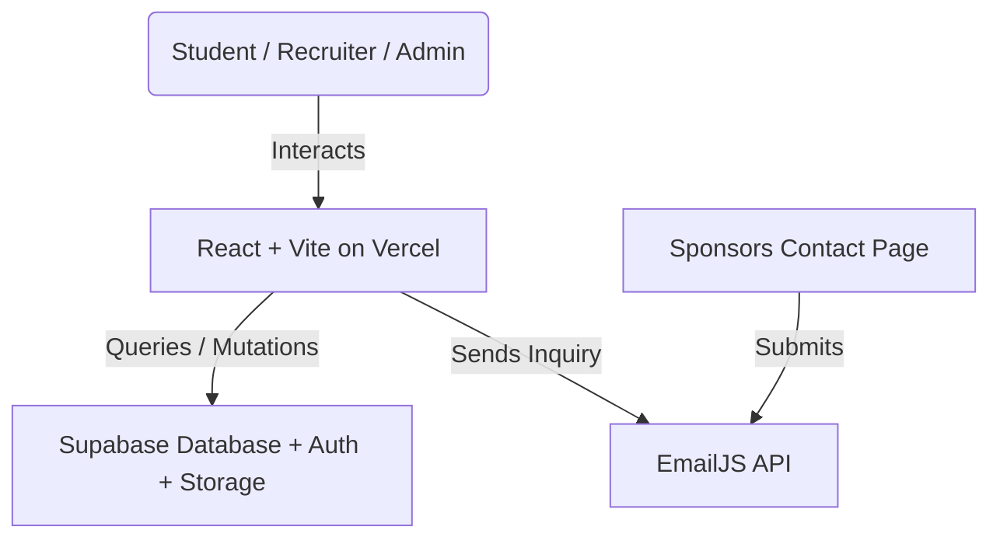

# SHPE OSU Website — Engineering Handoff

_Last updated: 2026-06-21_

This document serves as the developer documentation and handoff reference for the Digital Operations Chair and developers of the SHPE chapter at The Ohio State University. It covers system architecture, database design, security measures, maintenance protocols, and deployment details.

---

## 1. System Architecture

The SHPE OSU website is built as a serverless Single Page Application (SPA) to eliminate maintenance overhead and hosting costs for the student chapter.



### Architectural Principles
*   **Zero-Cost Hosting**: Vercel handles static frontend hosting on their free tier, while Supabase handles Database, Auth, and Storage on their free tier.
*   **Serverless Data Direct Access**: The client communicates directly with Supabase via `@supabase/supabase-js`. Database records and storage assets are secured entirely via **Row-Level Security (RLS)** rules.
*   **Static Configuration**: Fast updates (like adding events) are controlled by editing centralized JavaScript data structures instead of database queries.

---

## 2. Database Schema (PostgreSQL)

The application utilizes three tables and one storage bucket in Supabase.

### 1. `attendance`
Stores all student check-in records.
```sql
CREATE TABLE attendance (
  id uuid DEFAULT gen_random_uuid() PRIMARY KEY,
  created_at timestamptz DEFAULT now(),
  event_name text NOT NULL,
  first_name text NOT NULL,
  last_name_dotnum text NOT NULL,
  year text NOT NULL,
  is_first_meeting boolean NOT NULL,
  feedback text,
  major text, -- Stores standard major name or "Other – [custom text]"
  pronouns text,
  how_heard text
);
```

### 2. `resumes`
Stores student metadata and pointers to files in the Storage bucket.
```sql
CREATE TABLE resumes (
  id uuid DEFAULT gen_random_uuid() PRIMARY KEY,
  uploaded_at timestamptz DEFAULT now(),
  full_name text NOT NULL,
  email text NOT NULL,
  major text NOT NULL,
  graduation_year text NOT NULL,
  resume_path text NOT NULL, -- Format: submissions/timestamp_uuid.pdf
  approved boolean DEFAULT false NOT NULL
);
```

### 3. `company_access`
Stores access codes distributed to corporate recruiters.
```sql
CREATE TABLE company_access (
  id uuid DEFAULT gen_random_uuid() PRIMARY KEY,
  created_at timestamptz DEFAULT now(),
  company_name text NOT NULL,
  access_code text NOT NULL UNIQUE, -- 8-character uppercase string
  expires_at timestamptz -- Nullable, used to restrict access after events
);
```

### Supabase Storage Bucket: `resumes`
*   Contains a folder called `submissions/` where all resume files are stored.
*   All file permissions are private. Downloads/reads require generating a **Signed URL** with a 60-second TTL.

---

## 3. Security Architectures & Safeguards

The website contains several critical client-side and database-level security mechanisms.

### Row-Level Security (RLS) Policies
Do not modify or disable these policies without a clear security strategy.

| Table / Bucket | Policy Name | Role | Operations | Check/Condition |
|---|---|---|---|---|
| `attendance` | `Allow public inserts` | `public` | `INSERT` | `true` |
| `attendance` | `Admins can read attendance` | `authenticated` | `SELECT` | `auth.role() = 'authenticated'` |
| `attendance` | `Admins can update attendance` | `authenticated` | `UPDATE` | `auth.role() = 'authenticated'` |
| `resumes` | `Allow public inserts` | `public` | `INSERT` | `true` |
| `resumes` | `Authenticated select/update` | `authenticated` | `SELECT, UPDATE, DELETE` | `auth.role() = 'authenticated'` |
| `resumes` | `Recruiter code select` | `public` | `SELECT` | Allowed if recruiter has a valid `company_access` session (validated client-side, protected by signed URLs) |
| `company_access` | `Admins full access` | `authenticated` | `ALL` | `auth.role() = 'authenticated'` |
| `company_access` | `Public read code` | `public` | `SELECT` | `true` (restricted to query by code lookup) |

### Frontend Code Safeguards
1.  **Magic-Byte PDF Verification**:
    To prevent MIME-type spoofing (e.g. naming an executable malware file `resume.pdf`), `ResumeUpload.jsx` checks the first 4 bytes of the binary buffer for `%PDF` (`0x25, 0x50, 0x44, 0x46`):
    ```javascript
    async function isValidPDF(file) {
      const buf = await file.slice(0, 4).arrayBuffer();
      const bytes = new Uint8Array(buf);
      return PDF_MAGIC.every((b, i) => bytes[i] === b);
    }
    ```
2.  **Expiring Recruiter Sessions (TTL)**:
    Recruiter login tokens are saved in `sessionStorage` with a strict **8-hour Time-to-Live (TTL)** expiration window. The application uses a window visibility listener (`visibilitychange`) so if a recruiter focuses back on the browser tab after the TTL expires, they are immediately logged out:
    ```javascript
    const handleVisibilityChange = () => {
      if (document.visibilityState === 'visible') {
        const current = getCompanySession();
        if (!current) {
          clearCompanySession();
          navigate('/company');
        }
      }
    };
    ```
3.  **Cryptographically Secure Access Codes**:
    Codes generated for companies in `AdminResumes.jsx` use `crypto.getRandomValues()` instead of `Math.random()` to prevent code guessing attacks.
4.  **CSV Injection Prevention**:
    When exporting check-in tables, cells starting with formula triggers (`=`, `+`, `-`, `@`, tab, or carriage returns) are automatically prefixed with a single-quote `'` to mitigate spreadsheet software hijack attacks.
5.  **Safe Upload Filenames**:
    User-uploaded filenames are discarded. They are renamed on upload to `submissions/${Date.now()}_${crypto.randomUUID()}.pdf` to mitigate directory traversal and path traversal exploits.

---

## 4. Maintenance & Rollover Guide

### Weekly Content Updates (E-Board Workflow)
1.  Open `src/data/events.js`.
2.  Add a new event object at the top of the `events` array. Ensure the category matches one of the values: `"GBM" | "Social" | "Professional" | "Academic" | "Outreach" | "Fundraiser"`.
3.  If showing a photo, convert your image to `.webp` format and drop it into `public/photos/events/`.
4.  Reference the path: `photo: '/photos/events/imageName.webp'`.
5.  To highlight the event in the sidebar of the home page, set `featured: true`.
6.  Push changes to GitHub:
    ```bash
    git add .
    git commit -m "feat: add upcoming GBM"
    git push origin main
    ```
    Vercel will auto-deploy in under 60 seconds.

### Semester Rollover Protocols
At the start of a new semester (Autumn/Spring):
1.  **Clear/Archive Calendar**:
    *   Open `src/data/events.js` and move last semester's events to an archive file if desired, or clear the array, keeping only upcoming events.
    *   *Note: The attendance check-in form (`/attendance`) dynamically pulls event options from this array. Clearing old events keeps the check-in dropdown clean.*
2.  **E-Board Roster Update**:
    *   Collect new E-board member headshots, convert them to `.webp`, and place them in `public/photos/eboard/`.
    *   Open `src/pages/Eboard.jsx`. Update the `eboardMembers` array with names, majors, graduation years, and roles.
    *   To adjust vertical/horizontal alignment of any headshot, modify the conditional class mapping in `LoteriaCard` (e.g. `member.id === X ? 'object-top' : 'object-center'`).
3.  **Database Attendance Rollover**:
    *   Go to the Supabase Dashboard → SQL Editor.
    *   It is recommended to run a query to back up the current semester's check-ins before truncation, or export the full history to CSV from the Admin Dashboard.
4.  **Rotate Environment variables / Anon Keys**:
    *   If E-Board credentials leak, go to Supabase Dashboard → Project Settings → API.
    *   Click **Roll Project API Keys** for the `anon` key.
    *   Instantly update `VITE_SUPABASE_ANON_KEY` in the `.env` file and on Vercel Dashboard → Settings → Environment Variables.

---

## 5. Development & Contribution Guide

### Environment Variables
Setup a local `.env` file in the `shpe-osu` directory:
```env
VITE_SUPABASE_URL=https://your-project-id.supabase.co
VITE_SUPABASE_ANON_KEY=your-anon-key-here
```

### Useful CLI Commands
Run these commands inside the `/Users/leonardomedina/Documents/SHPE_web/shpe-osu` directory:

```bash
# Run local Vite development server
npm run dev

# Run local preview of build output
npm run preview

# Verify build succeeds before pushing to main
npm run build

# Run ESLint validation checks
npm run lint
```

### Git Branch Strategy
*   Never commit directly to `main` for large feature blocks.
*   Create a branch: `git checkout -b feature/your-feature-name`.
*   Verify the build locally (`npm run build`) before pushing your branch.
*   Merge branch into `main` via a GitHub Pull Request to trigger the Vercel production deployment pipeline.
