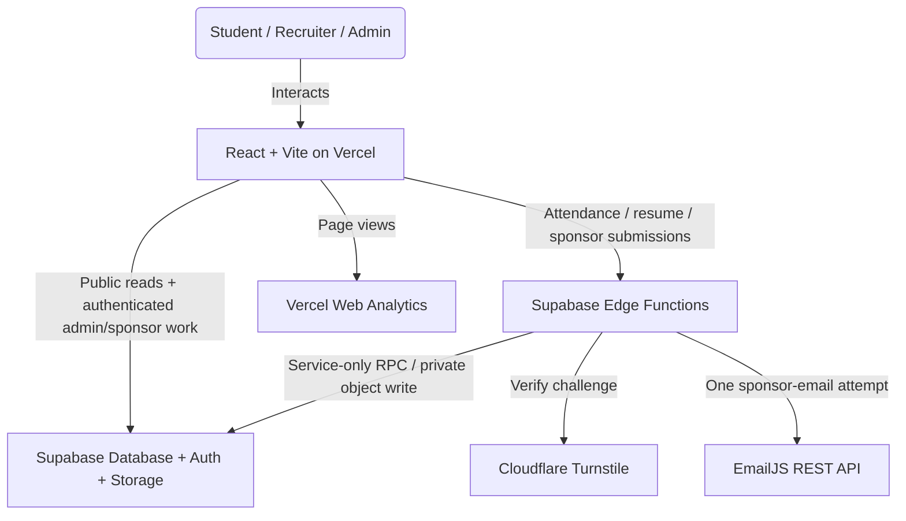

# SHPE OSU Website — Engineering Handoff

_Last updated: 2026-09-14; September 14 follow-up rollout pending._

Developer documentation for the Digital Operations Chair and anyone maintaining
the SHPE chapter website at The Ohio State University. Covers architecture,
database design, the security model, maintenance protocols, and deployment.

---

## 0. Where the site stands today

**Live at https://www.shpeosu.com, deployed from `main` via Vercel.** The
protected attendance, resume, and sponsor submission architecture is deployed
and its additive and final-lockdown migrations were applied to production on
2026-09-13.

The site is in good working order. A security review in July–August 2026 found
and closed a set of real problems; the notes below are deliberately blunt about
what was wrong, because the same mistakes are easy to repeat.

### What was fixed, and why it matters

| Area | What was wrong | State |
|---|---|---|
| **Resume book** | Approved resumes (names + OSU emails), recruiter access codes, and the resume PDFs themselves were readable by **anyone**, with no login and no code. Verified by downloading a real 130 KB resume anonymously. | ✅ Closed. Sponsors now sign in; access is enforced by Postgres. |
| **Sponsor contact form** | Every inquiry had been silently failing. The Content-Security-Policy omitted `api.emailjs.com`, so the browser blocked the request — invisible locally, because those headers only apply on Vercel. | ✅ Now delivered through a protected Edge Function; the browser has no EmailJS route or provider key. |
| **Resume replacement** | Never worked. The client issued an `UPDATE` no policy permitted, which under RLS affects zero rows and *returns success* — students saw "Upload Successful" while nothing changed. | ✅ Moved into the database. |
| **Leaderboard** | The public `leaderboard` view exposed every member's OSU dot number, and the Events page printed them on a public page. Views bypass RLS, so this read straight through the protection on `attendance`. | ✅ View reduced to first name + derived surname initial + count. |
| **Check-in** | Events added through the Admin Dashboard appeared on the calendar but could not be checked into — the check-in form read a different source. | ✅ One shared source. |
| **Upload size** | A 2 MB *minimum* rejected essentially every real resume (a normal one is 50–250 KB). | ✅ Now 10 KB–250 KB. |
| **Calendar exports** | `.ics` files were hardcoded to 06:00 UTC (2 AM Eastern) and the Google Calendar links produced unparseable dates. | ✅ Real times with an explicit timezone. |
| **`npm run lint`** | 93 errors, so nobody ran it and it caught nothing. | ✅ Clean, and a real gate. |

### Also fixed since

| Area | What was wrong | State |
|---|---|---|
| **Navigation scroll** | Clicking a tab loaded the new page at the old scroll offset and then animated to the top. Three causes: a global `scroll-behavior: smooth` that applied to the scroll-to-top as well as to anchors; `useEffect` running after paint; and the Sponsors page separately restoring its own scroll offset. | ✅ Instant, every route |
| **Footer links** | The footer kept a hand-written copy of the nav list and had drifted — Home and Prof. Dev. were missing, so two pages were unreachable from the bottom of every page. | ✅ One shared list |
| **Sponsor logos** | IBM removed at the president's request (it was a personal donation, not corporate). List updated to the five current sponsors and grouped by the tiers the chapter actually sells — the wall previously said Platinum/Gold/Bronze, which are not levels SHPE OSU offers. | ✅ Current |
| **Sponsor tier buttons** | All four "Get Started" buttons scrolled to a form that always defaulted to Buckeye ($500), so a Platinum enquiry arrived labelled as the cheapest tier. | ✅ Preselects |
| **Sponsors hero** | A ~16:9 photo in a 4:3 frame; `object-cover` discarded 27% of the width and cut people out of the group shot. | ✅ Matched |

### Security hardening live in production

The coordinated cutover completed on **2026-09-13**. Future changes must retain
the same order documented in `supabase/README.md`; source files alone never
prove that the corresponding live policy or function still exists.

| Surface | Production design | Status |
|---|---|---|
| **Attendance** | Browser calls `submit-attendance`; Edge verifies Turnstile, validates the canonical event, and invokes a service-only RPC with durable network and identity limits. Direct anonymous table inserts are revoked. | ✅ Live; browser submission passed before and after lockdown; direct anon insert denied |
| **Resume upload** | Browser sends one bounded multipart request to `submit-resume`; Edge validates the PDF, reserves a server-generated path, uploads privately, and queues a pending revision. Approval/deletion are atomic admin RPCs. | ✅ Live; upload/view/approve/delete passed; legacy RPC and direct Storage upload denied |
| **Sponsor inquiry** | Browser sends no EmailJS credentials. `submit-sponsor-inquiry` verifies Turnstile and durable quotas, then makes exactly one bounded EmailJS REST attempt. | ✅ Live; provider accepted and delivered a website inquiry |
| **Outage fallback** | The Google Form URL never contains attendee identity, demographics, or feedback. It is offered only after two genuine service failures, never after a validation, verification, or rate-limit rejection. | ✅ Live; form remains public/untrusted |
| **GroupMe invitation** | The project owner explicitly re-approved the original GroupMe invitation on 2026-09-03. | Exact original link restored on Home, Footer, and the first-attendance success screen; regression contract prevents silent destination drift |
| **Dependencies** | React Router and Vite were updated without `--force`; the production and full dependency audits are clean. Safari 14 remains an explicit build target. | ✅ Live |
| **Public leaderboard** | Both clients request ten rows, and the canonical view enforces the same top-ten cap so a direct caller cannot enumerate the remaining aggregates. It exposes only `first_name`, a SQL-derived one-character `last_initial`, and distinct-event `count`; the stored surname/dot number stays private and public roles receive `SELECT` only. | ✅ Applied and anonymously verified |

### September 14 follow-up — implemented locally, not yet marked live

The focused fixes move all three forms' durable quotas after successful
Turnstile verification, add bounded structural PDF screening before upload, and
persist retired resume paths for cleanup after approval/deletion. Invalid tokens
cannot consume a campus NAT's shared allowance. The existing identity and
presence limitations remain; pre-Siteverify flood protection is a separate
hosting-gateway concern.

`resume-cleanup.sql` must be applied before deploying `cleanup-resume-files`
and the matching frontend. The older frontend remains compatible with the
transactional triggers. Deploy all four Edge Functions for this follow-up;
local PGlite tests execute the actual SQL, but production status requires the
live probes in `supabase/README.md`. No existing files/rows are removed or
backfilled by the migration.

### September 14 quality follow-up — implemented locally, not deployed

Branch `fix/quality-review-followups` is stacked on `749ac0e`, the pending
security follow-up described above. These quality changes add no backend work;
the combined branch still requires the earlier security rollout before its
matching frontend is deployed.

- Admin datasets use counted pagination and publish only complete results.
  Errors or incomplete loads expose a retry control and withhold affected
  reports and exports. The reused date formatter preserves the existing
  display format, locale, and browser-local timezone.
- Calendar dates with multiple events offer separate event buttons and a
  complete day list through the overflow control, with focus restoration.
- Sponsor draft storage is optional: blocked storage, corrupt JSON, or malformed
  fields do not break the form, and cleanup cannot replace a confirmed success
  with an error.
- Professional-development counters clear their timers on unmount and restart
  correctly when React StrictMode replays effect setup and cleanup.

Verification: 290 tests in 36 files, lint, all Edge bundle checks, and the
production build pass. Both dependency audits report zero vulnerabilities.
Date-format regressions also pass in UTC, America/New_York, and
America/Los_Angeles. Independent review found no further actionable regression.
The preview at <http://127.0.0.1:4173/> serves the build with production headers;
browser access was not approved, so interactive/mobile visual review remains
pending. No production data or deployment was changed.

The build retains the mixed static/dynamic Supabase import warning. The initial
chunk is now 502.18 KB minified / 144.46 KB gzip, triggering Vite's 500 KB warning
(about 0.6 KB more gzip than before this quality patch). No new dependencies or
eager admin/Recharts imports were introduced; further bundle splitting is not
part of this focused fix.

### What is still open

*   **Upcoming events.** The first two Autumn 2026 events have passed. The E-Board
    will add the next dates through the Admin Dashboard (§4). The bundled event
    list is only the outage fallback and should not be treated as the editor.
*   **Sponsor accounts.** No recruiter accounts exist yet, so nobody can use the
    corporate portal. Two steps, and people forget the second one (§4).
*   **Resume ownership.** Submissions are keyed on email with no proof of
    ownership. Turnstile limits automation but does not prove the claimant owns
    that address. Bounded, not solved — see §3.
*   **Attendance identity/presence.** Turnstile, canonical-event validation,
    duplicate suppression, and durable limits reduce automated leaderboard
    poisoning; they do not prove that a submitted dot number belongs to the
    visitor or that the visitor attended. OSU SSO, a rotating event-scoped
    secret, or explicit admin review would be a separate product decision. The
    previously discussed form-lock workflow remains deferred.
*   **`PublicLeaderboard.jsx`** is committed but imported nowhere. Delete or mount.
*   **Gateway IP provenance.** The protected endpoints are live, but network
    limits remain defense in depth until a future staging environment proves
    which forwarding header Supabase supplies or overwrites when callers send
    conflicting values.
*   **Admin maintainability.** `AdminDashboard.jsx` is still one large five-tab
    file. The heavy admin, company, and professional-development routes are now
    code-split, but the dashboard itself should eventually be divided by tab.

## 1. System Architecture

The SHPE OSU website is built as a serverless Single Page Application (SPA) to eliminate maintenance overhead and hosting costs for the student chapter.



### Architectural Principles
*   **Zero-Cost Hosting**: Vercel handles static frontend hosting on their free tier, while Supabase handles Database, Auth, and Storage on their free tier.
*   **Least-Privilege Data Access**: The client uses `@supabase/supabase-js` for
    public reads and authenticated admin/sponsor work. Unauthenticated writes
    for attendance, resumes, and sponsor inquiries cross an Edge Function,
    Turnstile, strict validation, and durable rate limits. The browser never
    receives the Supabase service role or EmailJS provider credential.
*   **Non-Coders Can Update Content**: Events are added through the Admin Dashboard into the Supabase `events` table — no code, no deploy. `src/data/events.js` remains as a bundled fallback so the calendar and check-in still work if Supabase is unreachable. Both readers go through `src/lib/events.js`; keep it that way.
*   **Roles, Not Just Logins**: Admins and sponsors are both Supabase Auth users, so "signed in" is not a permission. Every policy checks an explicit role claim.
*   **Analytics**: `src/main.jsx` mounts `@vercel/analytics/react` once at the
    application root. Web Analytics must also be enabled in the Vercel project.
    Collection starts after deployment; local development traffic is not counted.
*   **Attendance trend dates**: The dashboard derives each trend point from the
    `M/D - title` prefix stored in `attendance.event_name`, using `created_at`
    only to infer the correct year. A late check-in therefore stays on its
    event's chart date while `created_at` remains the true audit timestamp.

---

## 2. Database Schema (PostgreSQL)

The live application utilizes five tables/views and one storage bucket in
Supabase. (`events` and `leaderboard` were added after the original draft of
this document — see §2.4 and §2.5.) The security migrations also add the internal,
RLS-locked `public_submission_rate_limits` and
`resume_submission_reservations` tables. The pending cleanup migration adds
`resume_file_cleanup`; its private rows include retry/lease state and permanent
completed path tombstones. They are internal implementation details, not browser
APIs; the cleanup worker uses service-only RPCs rather than direct table grants.

### 1. `attendance`
Stores all student check-in records.
```sql
CREATE TABLE attendance (
  id uuid DEFAULT gen_random_uuid() PRIMARY KEY,
  created_at timestamptz DEFAULT now(),
  event_name text NOT NULL,
  first_name text NOT NULL,
  last_name_dotnum text NOT NULL,
  year text NOT NULL,
  is_first_meeting boolean NOT NULL,
  feedback text,
  major text, -- Stores standard major name or "Other – [custom text]"
  pronouns text,
  how_heard text
);
```

### 2. `resumes`
Stores student metadata and pointers to files in the Storage bucket.
```sql
CREATE TABLE resumes (
  id uuid DEFAULT gen_random_uuid() PRIMARY KEY,
  uploaded_at timestamptz DEFAULT now(),
  full_name text NOT NULL,
  email text NOT NULL,
  major text NOT NULL,
  graduation_year text NOT NULL,
  resume_path text NOT NULL, -- Format: submissions/timestamp_uuid.pdf
  approved boolean DEFAULT false NOT NULL,
  submission_id uuid,                  -- idempotency key
  submission_fingerprint text          -- SHA-256 request binding
);
```

### 3. `company_access` — **vestigial**
Formerly stored access codes distributed to recruiters. That system was removed:
the table was publicly readable, so anyone could list every code, and the resume
book behind it was readable without a code anyway. Sponsors now use Supabase Auth
accounts. The table is kept only so historical rows are not lost — nothing reads
it for access. Drop it once you are confident no one is looking for an old code.
```sql
CREATE TABLE company_access (
  id uuid DEFAULT gen_random_uuid() PRIMARY KEY,
  created_at timestamptz DEFAULT now(),
  company_name text NOT NULL,
  access_code text NOT NULL UNIQUE, -- 8-character uppercase string
  expires_at timestamptz -- Nullable, used to restrict access after events
);
```

### Supabase Storage Bucket: `resumes`
*   Contains a folder called `submissions/` where all resume files are stored.
*   Uploads accept PDFs from **10 KB to 250 KB**. (A previous 2 MB *minimum* rejected essentially every legitimate resume, and the 5 MB ceiling let image-heavy exports eat the free-tier bucket.)
*   The 250 KB ceiling was chosen against the resumes actually on file (n=9: median 168 KB, max 305 KB). Expect it to reject roughly 1 in 5 submissions — mostly Canva/InDesign exports with an embedded photo. The upload form tells students their file's size and how to shrink it, and offers an E-Board fallback. If rejections become a support burden, change the browser constant in `src/lib/resume.js`, the Edge validation, the Storage bucket limit, tests, and documentation together; never raise only the client check.
*   All file permissions are private. Downloads/reads require generating a **Signed URL** with a 60-second TTL.

---

## 3. Security Architectures & Safeguards

The website contains several critical client-side and database-level security mechanisms.

### Row-Level Security (RLS) — resolved 2026-08-03

`supabase/README.md` is the authoritative description. Summary here.

**The rule that matters:** the client cannot enforce access. The anon key ships
inside the public JS bundle, so anyone can call PostgREST directly and skip the
interface. A check in a React component decides what is *rendered*, never what is
*reachable*.

That is not an abstract warning. The old policy on `resumes` was documented as
*"allowed if the recruiter has a valid session (validated client-side)"* — but
RLS runs per-row inside Postgres and cannot see browser JavaScript, so the policy
was effectively `USING (true)`. Public. The `sessionStorage` token in
`CompanyDashboard.jsx` protected nothing.

**What production enforces after the 2026-09-13 rollout**

| Table / bucket | anon | Edge `service_role` | sponsor | admin |
|---|---|---|---|---|
| `attendance` | — | validated submit RPC | — | full |
| `resumes` | — | reserve + queue RPCs | approved rows | full via atomic lifecycle RPCs |
| storage `resumes` | — | reserved private upload | approved files only | read through signed URLs |
| submission limiter/reservations | — | internal only | — | no direct client grant |
| `events` | SELECT | SELECT | SELECT | full |
| `leaderboard` view | `first_name`, derived `last_initial`, `count`; top ten | SELECT | SELECT | SELECT |

Turnstile is an automation signal, not authentication. CORS is browser
containment, not an anti-spam boundary. The security boundary is the combination
of server validation, service-only database functions, RLS/grants, strict
provider credentials, idempotency, and durable database counters.

Access is gated on an **explicit role claim**, not on merely being signed in.
Public signup is currently disabled, but that is defence in depth rather than
the permission boundary. If someone re-enables it, a self-registered account is
merely `authenticated`; without an explicit role it must still reach nothing.

**Roles live in `app_metadata`, never `user_metadata`.** A signed-in user can
rewrite their own `user_metadata` via `supabase.auth.updateUser()`, so a role
stored there would be self-grantable — any sponsor could promote themselves to
admin from the browser console.

The role is baked into the JWT at sign-in, so **anyone whose role changes must
sign out and back in.** An admin who suddenly lands on the login page has almost
certainly hit this.

**Views bypass RLS.** `public.leaderboard` runs with its owner's privileges on
purpose — that is what lets an anonymous visitor see the leaderboard without
opening `attendance`, which holds dot numbers, pronouns, majors, and free-text
feedback students wrote expecting privacy. The consequence: **any column added to
that view is published with no policy change and nothing to review.** Treat edits
to it as security changes.

**Checking live state.** Documentation in this repo has been wrong before, so
verify rather than trust:

```sql
SELECT schemaname, tablename, policyname, roles, cmd, qual, with_check
FROM pg_policies WHERE schemaname IN ('public','storage')
ORDER BY tablename, cmd;
```

Any `{public}`/`{anon}` row with `cmd` of `UPDATE`, `DELETE`, or `ALL` is a hole.
Note this query is the *only* honest way to check writes — PostgREST returns
success for a statement matching zero rows whether or not a policy permits it, so
write access cannot be probed from outside.

**⚠️ Two saved queries in the Supabase SQL Editor will silently undo all of this
if re-run:** "Attendance Submission Table" (contains the original public-read
policies) and "Leaderboard Attendance Aggregates" (the old dot-number view).
Rename them `⚠️ OLD — DO NOT RUN`.

### Code and data safeguards

1.  **Protected public submissions**:
    `Attendance.jsx`, `ResumeUpload.jsx`, and `Sponsors.jsx` invoke named Edge
    Functions. They never fall back to a direct table insert, public Storage
    upload, legacy resume RPC, or browser EmailJS request. Edge repeats all
    validation because browser checks are only usability. It verifies an
    action-bound Turnstile token and consumes HMAC-keyed database counters;
    raw IP addresses and dot numbers are not stored in the limiter table.

2.  **PDF screening (September 14 follow-up)**:
    Cheap metadata/type/size/header checks precede Turnstile. Only a verified,
    quota-allowed request reaches the backend structural/active-content parser,
    which requires a complete static PDF with one to ten pages. Input remains
    10–250 KB, expanded streams are capped at 8 MB, and nesting at 64. Scripts,
    attachments, encryption, interactive forms, and unsupported features are
    rejected with guidance to export a fresh static PDF. This is not antivirus
    and does not rewrite or rescan existing uploads. Exact budgets and pinned
    backend dependencies are documented in `supabase/README.md`.

3.  **Safe resume retries and approval**:
    Edge binds a UUID to a SHA-256 fingerprint and a server-generated exact
    path of `submissions/<13-digit timestamp>_<uuid>.pdf`. An exact retry
    converges on that reservation; changed content cannot reuse it. A claimed
    email always creates a pending revision and cannot de-list an existing
    approved resume. Admin approve/delete operations lock and re-check the row
    in authenticated-admin atomic RPCs instead of trusting a zero-row browser
    update. The pending cleanup extension queues every deleted sibling path in
    that same transaction. Cleanup never removes the replacement's active file.

4.  **Sponsor Access — Supabase Auth**:
    Recruiters sign in with an email and password and are granted a `sponsor`
    role. This replaced an 8-character code checked in the browser against a
    publicly-readable table, with the session held in `sessionStorage` — which a
    recruiter could simply write by hand. All of that machinery is deleted;
    `src/lib/companySession.js` no longer exists. Enforcement is in the database.

5.  **Sponsor inquiry delivery**:
    EmailJS service, template, and public credentials exist only in
    Edge secrets. The request schema rejects unknown fields and client-supplied
    routing, and the server makes one timed provider attempt with no automatic
    retry. Ambiguous delivery tells the visitor to email directly instead of
    risking a duplicate. This Free EmailJS account does not expose a private
    key: non-browser API access is enabled, strict/private-key mode is disabled,
    and the public key rotated at cutover is stored only in Supabase Edge
    secrets. Enable private-key enforcement if the provider later offers it.

6.  **CSV Injection Prevention**:
    When exporting check-in tables, cells starting with formula triggers (`=`, `+`, `-`, `@`, tab, or carriage returns) are automatically prefixed with a single-quote `'` to mitigate spreadsheet software hijack attacks.

7.  **Outage fallback privacy**:
    The Google Form link contains no name, dot number, year, first-meeting
    answer, major, discovery source, or feedback. At most it may carry the
    canonical event label once its real Google entry ID is verified. Responses
    remain unauthenticated and quarantined in the Sheet until an admin validates
    and manually imports them.

---

## 4. Maintenance & Rollover Guide

### Weekly Content Updates (E-Board Workflow)
1.  Open the Admin Dashboard and select the **Events** tab.
2.  Add or edit the event there. Use one of the supported categories:
    `"GBM" | "Social" | "Professional" | "Academic" | "Outreach" | "Fundraiser"`.
    The image is optional. Events without one use the official SHPE logo;
    uploaded flyers are displayed uncropped and link to the original full-size
    file from the event details modal.
3.  Confirm it appears on `/events` and in the `/attendance` dropdown. Both read
    through `src/lib/events.js`, so there should be no second code change.
4.  Before an event where check-in must survive a Supabase outage, mirror the
    exact title and date into `src/data/events.js` on a branch. This is an
    intentional emergency fallback, not the normal content workflow. A title or
    date mismatch creates a duplicate and can split attendance history.

### The attendance QR code

`qr/attendance.png` and `qr/attendance.svg` encode
**https://www.shpeosu.com/attendance**. Send the PNG for Slack, the SVG for print.

**It never expires and never needs refreshing.** A QR code is just a URL drawn as
an image — there is no account, no service, and nothing phoning home. It works
for as long as that URL works. Regenerate only if the route is renamed, the
domain changes, or it should point somewhere else:

```bash
npm run qr
```

Deliberately NOT a "dynamic QR" from a generator website. Those route through the
vendor's servers and die when the free tier ends or the company folds — taking
every printed poster with them. This one has no third party in the path, so the
destination can be changed from this repo without reprinting anything.

**⚠️ The one thing that would break every printed code: domain expiry.**
`shpeosu.com` is registered through Cloudflare and expires **2027-05-18**. If it
lapses, every QR on every table tent stops working at the same moment, along with
the site. Make sure auto-renew is on and the card on file outlives whoever added
it — a graduating member's personal card is the usual way this fails.

Printing: ~1.5 in for a table tent, ~4 in for a poster. Print the URL as text
underneath as a fallback, never crop the white border, and test on both an iPhone
and an Android before sending to print.

### Backup check-in form

**The problem it solves.** If two genuine `submit-attendance` service attempts
cannot be confirmed, `src/lib/attendanceFallback.js` offers a link to the
chapter's Google Form. It is an outage escape hatch, not a second normal
submission API.

**When it must not appear.** Never offer it after `invalid_submission`,
`verification_required`, `verification_failed`, or `rate_limited`. Doing so
would turn the fallback into a bypass for the protected endpoint. It also cannot
help if venue Wi-Fi is down; keep a paper sign-in sheet for that case.

**Privacy boundary.** No attendee data is prefilled. Names, dot numbers,
demographics, major, discovery source, and feedback must never appear in a URL,
where they can reach browser history, proxy logs, copied links, referrers, and
screenshots. The URL builder has a hard allowlist for the canonical event label
only. Its Google `entry.*` ID is currently blank because it has not been
verified, so the current link carries no form answers at all.

The configured form is:
[26 - 27 SHPE Attendance Form Professional Development](https://docs.google.com/forms/d/e/1FAIpQLSetATIx52meiHRLa0jWvAe67AXKAvlS1D_H3Wy7P2w0v-7wrQ/viewform).
Blank `FALLBACK_FORM.baseUrl` to disable the fallback without changing the UI.

To configure event-only prefill later:

1. Make the form accept the exact `eventOptionLabel()` value: `M/D - title`.
2. Use Google Forms' **Get pre-filled link** flow with a dummy event value.
3. Copy the resulting `entry.<digits>` identifier into `event_name`; never
   guess it and never add another field to the allowlist.
4. Test that the correct event appears without any identity in the URL.

**Responses are quarantined.** The Google Form is public and its Sheet is
untrusted. Nothing automatically imports those rows into `attendance` or mixes
them into leaderboard/chart totals. An admin must compare them with who was in
the room, normalize the event to the exact `M/D - title` contract, check for
duplicates, and use parameterized Table Editor/CSV tooling for a deliberate
manual import. Never paste untrusted answers into hand-built SQL. Clear or
archive the Sheet after reconciliation so semesters do not mix.

Before any manual import, check duplicates against existing attendance:

```sql
SELECT event_name, first_name, last_name_dotnum, count(*)
FROM attendance GROUP BY 1,2,3 HAVING count(*) > 1;
```

### Retired resume file cleanup (after the September 14 rollout)

Approval or deletion records retired file paths inside its database transaction.
The `cleanup-resume-files` Edge endpoint verifies the admin bearer through Auth
and server-controlled `app_metadata.role`, then claims up to five detached paths
from the private queue. It deletes through the Storage API; browser requests
cannot supply paths. Permanent tombstones and reference guards prevent retired
paths from being reused, and late in-flight uploads become eligible again.

The dashboard requests a pass on visits and successful approval/deletion. If
**Some retired resume files still need removal** appears, the files remain
private and the queue retains the work. **Retry file cleanup** requests another
pass; failed attempts become eligible after 30 seconds, increasing up to one
hour. Interrupted claims expire after two minutes. There is no scheduled worker:
eligibility requires a later admin visit/action to run cleanup. Never truncate
the queue, delete its completed tombstones, or turn this into an automatic
backfill of unrelated old files.

### Sponsor inquiry operations

The public sponsor form calls `submit-sponsor-inquiry`; only that Edge Function
talks to EmailJS. Configure its secrets from `supabase/functions/.env.example`.
Do not create `VITE_EMAILJS_*` variables or add `api.emailjs.com` to browser
`connect-src`.

Current production configuration:

1. The EmailJS service ID, template ID, and rotated public key are Supabase Edge
   secrets. The current Free plan does not expose a private key. Never put these
   values in Vite or deploy the example Turnstile secret/`dummy-key-pass` host.
2. In EmailJS **Account → Security**, non-browser API access is enabled and
   **Use Private Key** is disabled because no private key exists on this plan.
   If the feature becomes available, add `EMAILJS_PRIVATE_KEY` to Edge and turn
   strict mode on in the same maintenance window.
3. Keep recipient, sender, and subject fixed in the provider template. Render
   visitor values with escaped double braces, not raw triple braces; include the
   generated `inquiry_id` in the admin-visible message so an ambiguous delivery
   can be correlated, and do not send an automatic reply to the unverified
   address.
4. Set exact production/preview origins and Turnstile hostnames. Wildcard Vercel
   previews are deliberately not accepted.
5. Confirm in staging that Supabase's gateway supplies a trustworthy client IP
   and that spoofed forwarding headers cannot choose another limiter identity.
6. Exercise success, validation rejection, Turnstile rejection, quota rejection,
   timeout, and ambiguous provider failure. The server must never retry the
   email side effect automatically.

### Onboarding a Corporate Sponsor

1.  Supabase Dashboard → **Authentication → Users → Add user**
    *   Email: the recruiter's work address
    *   Password: generate one and send it to them
    *   **Auto-confirm: ON** — without it they never receive a usable login
2.  Grant the sponsor role in the SQL Editor:
    ```sql
    UPDATE auth.users
    SET raw_app_meta_data =
          coalesce(raw_app_meta_data,'{}'::jsonb) || '{"role":"sponsor"}'::jsonb
    WHERE email = 'recruiter@company.com';
    ```
    **This step is the one people forget.** Without it they sign in successfully
    and see an empty resume book. The dashboard now says so explicitly rather
    than showing "no resumes match your criteria", but it still wastes everyone's
    time.
3.  Send them the credentials. They sign in at `/company`.

Revoking access is deleting the user, or clearing the role. The same steps are
shown in the Admin Dashboard's Companies tab.

### Adding an E-Board Admin

Same as above, but with `"role":"admin"`. Admins see the pending resume queue and
attendance data; sponsors see neither. Anyone whose role changes must sign out
and back in.

### Semester Rollover Protocols
At the start of a new semester (Autumn/Spring):
1.  **Add the new semester's events** — do this **before the first GBM**, or the
    check-in form has nothing current to select and nobody can check in.
    *   Preferred: Admin Dashboard → **Events** tab. Goes into Supabase, appears
        on the calendar and in the check-in dropdown immediately, no deploy.
    *   `src/data/events.js` is only the offline fallback. Old entries there are
        harmless — the check-in dropdown shows upcoming events first and falls
        back to recent ones, so stale entries do not crowd out real ones.
2.  **E-Board Roster Update**:
    *   Collect new E-board member headshots, convert them to `.webp`, and place them in `public/photos/eboard/`.
    *   Open `src/pages/Eboard.jsx`. Update the `eboardMembers` array with names, majors, graduation years, and roles.
    *   To adjust vertical/horizontal alignment of any headshot, modify the conditional class mapping in `LoteriaCard` (e.g. `member.id === X ? 'object-top' : 'object-center'`).
3.  **Database Attendance Rollover**:
    *   Go to the Supabase Dashboard → SQL Editor.
    *   It is recommended to run a query to back up the current semester's check-ins before truncation, or export the full history to CSV from the Admin Dashboard.
4.  **Review accounts**: graduating E-Board members should have their Supabase
    Auth accounts deleted, and expired sponsors likewise. Check with:
    ```sql
    SELECT email, raw_app_meta_data ->> 'role' AS role FROM auth.users;
    ```
5.  **Rotate Environment variables / Anon Keys**:
    *   If E-Board credentials leak, go to Supabase Dashboard → Project Settings → API.
    *   Click **Roll Project API Keys** for the `anon` key.
    *   Instantly update `VITE_SUPABASE_ANON_KEY` in the `.env` file and on Vercel Dashboard → Settings → Environment Variables.

---

## 5. Development & Contribution Guide

### Environment Variables
Setup a local `.env` file in the `shpe-osu` directory:
```env
VITE_SUPABASE_URL=https://your-project-id.supabase.co
VITE_SUPABASE_ANON_KEY=your-anon-key-here
VITE_TURNSTILE_SITE_KEY=your-site-key-here
```

Use Node `^20.19.0` or `>=22.12.0`. Edge-only secrets belong in Supabase, never
in Vite; `supabase/functions/.env.example` is the complete template for local
function development. A variable prefixed `VITE_` is public by design.

### Useful CLI Commands
Run these commands inside the `/Users/leonardomedina/Documents/SHPE_web/shpe-osu` directory:

```bash
# Run local Vite development server
npm run dev

# Run local preview of build output
npm run preview

# Verify build succeeds before pushing to main
npm run build

# Run ESLint validation checks
npm run lint

# Run the unit/security regression suite
npm test

# Type-check/bundle all Supabase Edge Function entry points
npm run check:edge

# Dependency vulnerability gates
npm audit --omit=dev
npm audit
```

### Git Branch Strategy
*   **Always work on a branch unless the project owner explicitly says to work
    on `main`.** This applies to fixes, documentation, and content changes—not
    only large features.
*   Start from an up-to-date `main`, then create a focused branch:
    ```bash
    git switch main
    git pull --ff-only
    git switch -c feature/your-change
    ```
*   Review ordinary UI work with `npm run dev` at
    <http://localhost:5173>.
*   Before pushing, run `npm test`, `npm run lint`, `npm run check:edge`, both
    dependency audits, `npm run build`, then `npm run preview`.
    Preview normally runs at <http://localhost:4173> and includes the production
    security headers that `npm run dev` does not.
*   Merge the branch into `main` through a GitHub Pull Request. Vercel deploys
    production from `main`; do not merge until the local review is approved.

---

## 6. Addendum — tables added after the original draft

### 2.4 `events`
Dynamic calendar events created from the Admin Dashboard's **Events** tab.

```sql
CREATE TABLE events (
  id uuid DEFAULT gen_random_uuid() PRIMARY KEY,
  created_at timestamptz DEFAULT now(),
  title text NOT NULL, date text NOT NULL, time text NOT NULL,
  end_time text, location text NOT NULL, description text NOT NULL,
  category text NOT NULL, featured boolean DEFAULT false NOT NULL,
  rsvp_url text DEFAULT '', photo text DEFAULT ''
);
```

Both the public calendar and the attendance check-in dropdown read this table
through `src/lib/events.js`, which merges it with the bundled fallback in
`src/data/events.js`. An event added in the Admin Dashboard is therefore
immediately checkinable.

This was previously a real trap: `Attendance.jsx` read only the static file, so a
dashboard-added event showed on the calendar but could not be checked into, with
no error explaining why. Keep both readers going through `lib/events.js` — that
split is exactly the kind that produces a silent failure at a live meeting.

### 2.5 `leaderboard` (view)
Read by `Events.jsx` and `PublicLeaderboard.jsx`. The original two-column privacy
revision of `supabase/leaderboard-view.sql` was applied 2026-07-30, and the
database-level top-ten cap plus the approved surname-initial display were applied
and anonymously verified 2026-09-13. The view exposes exactly `first_name`, a
SQL-derived one-character `last_initial`, and a **distinct-event** `count`. It
previously also returned `last_name_dotnum` and `dotnum`, which were rendered
onto a public page. Do not add more columns: the view runs with owner privileges
and bypasses RLS on `attendance`, so anything added here is published with no
policy change to review.

---

## 7. Local verification before pushing

Do this from a feature/fix/docs branch unless the project owner explicitly
authorized work directly on `main`.

```bash
npm test
npm run lint     # must be clean — it is now a real gate (was 93 errors)
npm run check:edge
npm audit --omit=dev
npm audit
npm run build
npm run preview  # serves dist/ WITH the production headers from vercel.json
```

`vite.config.js` reads `vercel.json` and applies the same security headers to
the preview server. This exists because a missing `connect-src` entry silently
broke the sponsor contact form in production and was invisible locally — CSP
headers only applied on Vercel. Open the browser console on `npm run preview`
and confirm there are no CSP violations before deploying.

**Lint and build do not catch everything.** Both passed while the sponsor form
was completely broken in production, while calendar exports emitted 2 AM events,
and while a "View PDF" button opened a blank tab and hijacked the current one.
Click the thing you changed.

After deploying an Analytics change, visit more than one production route and
confirm the browser Network panel shows Vercel's same-origin analytics request.
The current CSP already permits the Vercel-managed same-origin endpoint; do not
add a broad external script or connection source without evidence it is needed.

The app lazily loads the admin dashboard, recruiter dashboard, and
professional-development page. Preserve that boundary and investigate the
build output if a change collapses them back into one eager bundle.

### Protected-submission redeployment order

The authoritative command-by-command checklist is in `supabase/README.md`.
The production cutover completed on 2026-09-13. Preserve this order if rebuilding
or materially changing the boundary:

1. Back up/inventory production and rehearse on staging. Prove the gateway IP
   behavior, exact origins/hostnames, real Turnstile, and EmailJS template.
2. Apply additive `attendance-submit.sql`, then `resume-edge-submit.sql`.
3. Deploy all three Edge Functions with real server-only secrets and exercise
   them before changing the browser.
4. Deploy the matching frontend, verify all three forms, then immediately apply
   `attendance-lockdown.sql` and `resume-lockdown.sql` so the legacy anonymous
   paths are gone.
5. Rotate the EmailJS public key and prove the historical key fails. On the
   current Free plan, keep non-browser API access enabled and strict/private-key
   mode disabled; if EmailJS later provides a private key, enable and verify it
   as an additional control.
6. Re-run anonymous-denial, admin/sponsor authorization, duplicate/idempotency,
   leaderboard-shape, Storage, rate-limit, and provider probes before merging
   or declaring production complete.

### Project subagents

`.claude/agents/` holds three read-only reviewers preloaded with this codebase's
actual failure modes:

| Agent | Use it |
|---|---|
| `security-auditor` | After touching Supabase, before a release |
| `code-reviewer` | Before committing |
| `deploy-preflight` | Before pushing to `main`, and at semester rollover |

Invoke them by name in Claude Code, e.g. *"Use the security-auditor agent to
check the current RLS posture."* They found the role-gating hole described in §3,
a check-in bug that would have stranded an entire GBM, and a timezone error that
only misfired during meeting hours — all in work that had already been reviewed
by hand and passed both gates.
