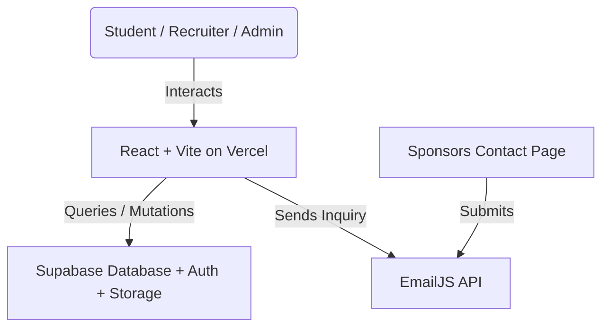

# SHPE OSU Website — Engineering Handoff

_Last updated: 2026-06-21_

This document serves as the developer documentation and handoff reference for the Digital Operations Chair and developers of the SHPE chapter at The Ohio State University. It covers system architecture, database design, security measures, maintenance protocols, and deployment details.

---

## 1. System Architecture

The SHPE OSU website is built as a serverless Single Page Application (SPA) to eliminate maintenance overhead and hosting costs for the student chapter.



### Architectural Principles
*   **Zero-Cost Hosting**: Vercel handles static frontend hosting on their free tier, while Supabase handles Database, Auth, and Storage on their free tier.
*   **Serverless Data Direct Access**: The client communicates directly with Supabase via `@supabase/supabase-js`. Database records and storage assets are secured entirely via **Row-Level Security (RLS)** rules.
*   **Static Configuration**: Fast updates (like adding events) are controlled by editing centralized JavaScript data structures instead of database queries.

---

## 2. Database Schema (PostgreSQL)

The application utilizes five tables/views and one storage bucket in Supabase. (`events` and `leaderboard` were added after the original draft of this document — see §2.4 and §2.5.)

### 1. `attendance`
Stores all student check-in records.
```sql
CREATE TABLE attendance (
  id uuid DEFAULT gen_random_uuid() PRIMARY KEY,
  created_at timestamptz DEFAULT now(),
  event_name text NOT NULL,
  first_name text NOT NULL,
  last_name_dotnum text NOT NULL,
  year text NOT NULL,
  is_first_meeting boolean NOT NULL,
  feedback text,
  major text, -- Stores standard major name or "Other – [custom text]"
  pronouns text,
  how_heard text
);
```

### 2. `resumes`
Stores student metadata and pointers to files in the Storage bucket.
```sql
CREATE TABLE resumes (
  id uuid DEFAULT gen_random_uuid() PRIMARY KEY,
  uploaded_at timestamptz DEFAULT now(),
  full_name text NOT NULL,
  email text NOT NULL,
  major text NOT NULL,
  graduation_year text NOT NULL,
  resume_path text NOT NULL, -- Format: submissions/timestamp_uuid.pdf
  approved boolean DEFAULT false NOT NULL
);
```

### 3. `company_access`
Stores access codes distributed to corporate recruiters.
```sql
CREATE TABLE company_access (
  id uuid DEFAULT gen_random_uuid() PRIMARY KEY,
  created_at timestamptz DEFAULT now(),
  company_name text NOT NULL,
  access_code text NOT NULL UNIQUE, -- 8-character uppercase string
  expires_at timestamptz -- Nullable, used to restrict access after events
);
```

### Supabase Storage Bucket: `resumes`
*   Contains a folder called `submissions/` where all resume files are stored.
*   Uploads accept PDFs from **10 KB to 250 KB**. (A previous 2 MB *minimum* rejected essentially every legitimate resume, and the 5 MB ceiling let image-heavy exports eat the free-tier bucket.)
*   The 250 KB ceiling was chosen against the resumes actually on file (n=9: median 168 KB, max 305 KB). Expect it to reject roughly 1 in 5 submissions — mostly Canva/InDesign exports with an embedded photo. The upload form tells students their file's size and how to shrink it, and offers an E-Board fallback. If rejections become a support burden, raise `MAX_FILE_SIZE_BYTES` in `src/pages/ResumeUpload.jsx`; 300 KB would have accepted 8 of the 9.
*   All file permissions are private. Downloads/reads require generating a **Signed URL** with a 60-second TTL.

---

## 3. Security Architectures & Safeguards

The website contains several critical client-side and database-level security mechanisms.

### ⚠️ Row-Level Security (RLS) — OPEN ISSUE, ACTION REQUIRED

**The table below described the intended model, not the live one.** Probing the
production project with only the public anon key — the same key embedded in our
JS bundle — while logged out returned:

| Probe (anonymous, logged out) | Result |
|---|---|
| `select * from resumes` | **All rows**, including `full_name`, `email`, `major`, `graduation_year`, `resume_path` |
| `storage.createSignedUrl(<resume_path>)` | **Granted** — the URL returned HTTP 200, `application/pdf`, a real resume |
| `select * from company_access` | **All rows, including `access_code`** |
| `insert into resumes` with `approved = true` | **Permitted** — the INSERT policy's `WITH CHECK` is `true`, so anyone can publish straight into the recruiter-visible book, skipping E-Board review entirely. Paired with the public upload policy on the storage bucket, an outsider can put their own PDF in front of sponsors. Fixed by `supabase/sponsor-auth.sql` and `supabase/resume-submit.sql`, which route every submission through a validated `submit_resume()` function. |
| `insert into company_access` / `events` | Blocked ✅ |
| Storage bucket public URL | Blocked ✅ (but irrelevant — signed URLs worked) |
| `attendance` public SELECT | None ✅ — table is closed, see §5 note below |

So the resume book was fully downloadable with no access code, and the codes
themselves were readable by the same anonymous request.

The root cause is a category error worth internalising: the old policy
`Recruiter code select` was documented as *"allowed if recruiter has a valid
session (validated client-side)"*. **RLS runs per-row inside Postgres and cannot
see client-side JavaScript.** A policy of `USING (true)` is public, full stop.
No amount of `sessionStorage` checking in `CompanyDashboard.jsx` changes it —
anyone can call PostgREST directly with the anon key and skip the UI entirely.

**Fix:** access codes are gone. Sponsors are now real Supabase Auth users, so
Postgres enforces access rather than JavaScript. See `supabase/README.md` for the
model and run order — `sponsor-auth.sql` then `resume-submit.sql`, alongside the
matching client deploy. Neither has been applied yet.

**Resolved — there are no anonymous writes beyond INSERT.** This was previously
listed as unknown, because a PostgREST delete matching zero rows returns success
whether or not a policy permits it, so it cannot be probed from outside. A
`pg_policies` query settled it: every `{public}` policy is `INSERT` or `SELECT`.
No `anon` `UPDATE`, `DELETE`, or `ALL` exists on any table. Nobody can wipe the
attendance history or rewrite recruiter codes.

Re-run the `pg_policies` query in `supabase/README.md` after any policy change, and treat any
new `anon`/`public` row with `cmd` of `UPDATE`/`DELETE`/`ALL` as a hole.

**Correction — `attendance` is NOT publicly readable.** An earlier revision of
this document said public read on `attendance` was live and intentional. A
`pg_policies` query against production disproves it: the table has only
`Allow public inserts` (INSERT, public) and `Admins can read attendance`
(SELECT, authenticated). It is closed, and should stay closed.

The real leak was the **`leaderboard` view**. A Postgres view runs with its
owner's privileges by default, so it read straight through that RLS — and it
exposed `last_name_dotnum` and `dotnum`, which `Events.jsx` rendered onto a
public page. Every member's OSU dot number was published. Fixed by
`supabase/leaderboard-view.sql`, which redefines the view as `first_name` and a
distinct-event `count` only.

Keep in mind what that implies: the view is a standing RLS bypass on
`attendance`. Any column added to it in future becomes public with no policy
change and nothing to review. Treat edits to that view as security changes.

### Frontend Code Safeguards
1.  **Magic-Byte PDF Verification**:
    To prevent MIME-type spoofing (e.g. naming an executable malware file `resume.pdf`), `ResumeUpload.jsx` checks the first 4 bytes of the binary buffer for `%PDF` (`0x25, 0x50, 0x44, 0x46`):
    ```javascript
    async function isValidPDF(file) {
      const buf = await file.slice(0, 4).arrayBuffer();
      const bytes = new Uint8Array(buf);
      return PDF_MAGIC.every((b, i) => bytes[i] === b);
    }
    ```
2.  **Expiring Recruiter Sessions (TTL)** — *convenience, NOT a security control*:
    This is the misconception that produced the RLS hole above, so it is worth
    stating plainly: **anything enforced in the browser is not enforced.** A
    recruiter can edit `sessionStorage` in devtools, or skip the UI entirely and
    query PostgREST with the anon key. The TTL below is a courtesy logout on a
    shared machine, nothing more. Real enforcement lives in
    the database policies. This whole section is now historical: access codes
    were replaced by Supabase Auth logins, and `companySession.js` was deleted.

    Recruiter login tokens are saved in `sessionStorage` with an **8-hour Time-to-Live (TTL)** expiration window. The application uses a window visibility listener (`visibilitychange`) so if a recruiter focuses back on the browser tab after the TTL expires, they are immediately logged out:
    ```javascript
    const handleVisibilityChange = () => {
      if (document.visibilityState === 'visible') {
        const current = getCompanySession();
        if (!current) {
          clearCompanySession();
          navigate('/company');
        }
      }
    };
    ```
3.  **Cryptographically Secure Access Codes**:
    Codes generated for companies in `AdminDashboard.jsx` use `crypto.getRandomValues()` indexed into an explicit 32-character alphabet (8 chars = 40 bits). The earlier version did `byte.toString(36).padStart(2,'0')` per byte and then sliced to 8, which silently discarded a byte and could only ever emit 0–7 as the first character of each pair.
4.  **CSV Injection Prevention**:
    When exporting check-in tables, cells starting with formula triggers (`=`, `+`, `-`, `@`, tab, or carriage returns) are automatically prefixed with a single-quote `'` to mitigate spreadsheet software hijack attacks.
5.  **Safe Upload Filenames**:
    User-uploaded filenames are discarded. They are renamed on upload to `submissions/${Date.now()}_${crypto.randomUUID()}.pdf` to mitigate directory traversal and path traversal exploits.

---

## 4. Maintenance & Rollover Guide

### Weekly Content Updates (E-Board Workflow)
1.  Open `src/data/events.js`.
2.  Add a new event object at the top of the `events` array. Ensure the category matches one of the values: `"GBM" | "Social" | "Professional" | "Academic" | "Outreach" | "Fundraiser"`.
3.  If showing a photo, convert your image to `.webp` format and drop it into `public/photos/events/`.
4.  Reference the path: `photo: '/photos/events/imageName.webp'`.
5.  To highlight the event in the sidebar of the home page, set `featured: true`.
6.  Push changes to GitHub:
    ```bash
    git add .
    git commit -m "feat: add upcoming GBM"
    git push origin main
    ```
    Vercel will auto-deploy in under 60 seconds.

### Semester Rollover Protocols
At the start of a new semester (Autumn/Spring):
1.  **Clear/Archive Calendar**:
    *   Open `src/data/events.js` and move last semester's events to an archive file if desired, or clear the array, keeping only upcoming events.
    *   *Note: The attendance check-in form (`/attendance`) dynamically pulls event options from this array. Clearing old events keeps the check-in dropdown clean.*
2.  **E-Board Roster Update**:
    *   Collect new E-board member headshots, convert them to `.webp`, and place them in `public/photos/eboard/`.
    *   Open `src/pages/Eboard.jsx`. Update the `eboardMembers` array with names, majors, graduation years, and roles.
    *   To adjust vertical/horizontal alignment of any headshot, modify the conditional class mapping in `LoteriaCard` (e.g. `member.id === X ? 'object-top' : 'object-center'`).
3.  **Database Attendance Rollover**:
    *   Go to the Supabase Dashboard → SQL Editor.
    *   It is recommended to run a query to back up the current semester's check-ins before truncation, or export the full history to CSV from the Admin Dashboard.
4.  **Rotate Environment variables / Anon Keys**:
    *   If E-Board credentials leak, go to Supabase Dashboard → Project Settings → API.
    *   Click **Roll Project API Keys** for the `anon` key.
    *   Instantly update `VITE_SUPABASE_ANON_KEY` in the `.env` file and on Vercel Dashboard → Settings → Environment Variables.

---

## 5. Development & Contribution Guide

### Environment Variables
Setup a local `.env` file in the `shpe-osu` directory:
```env
VITE_SUPABASE_URL=https://your-project-id.supabase.co
VITE_SUPABASE_ANON_KEY=your-anon-key-here
```

### Useful CLI Commands
Run these commands inside the `/Users/leonardomedina/Documents/SHPE_web/shpe-osu` directory:

```bash
# Run local Vite development server
npm run dev

# Run local preview of build output
npm run preview

# Verify build succeeds before pushing to main
npm run build

# Run ESLint validation checks
npm run lint
```

### Git Branch Strategy
*   Never commit directly to `main` for large feature blocks.
*   Create a branch: `git checkout -b feature/your-feature-name`.
*   Verify the build locally (`npm run build`) before pushing your branch.
*   Merge branch into `main` via a GitHub Pull Request to trigger the Vercel production deployment pipeline.

---

## 6. Addendum — tables added after the original draft

### 2.4 `events`
Dynamic calendar events created from the Admin Dashboard's **Events** tab.

```sql
CREATE TABLE events (
  id uuid DEFAULT gen_random_uuid() PRIMARY KEY,
  created_at timestamptz DEFAULT now(),
  title text NOT NULL, date text NOT NULL, time text NOT NULL,
  end_time text, location text NOT NULL, description text NOT NULL,
  category text NOT NULL, featured boolean DEFAULT false NOT NULL,
  rsvp_url text DEFAULT '', photo text DEFAULT ''
);
```

**Known gap:** `Events.jsx` merges this table with the static `src/data/events.js`
array, but `Attendance.jsx` builds its check-in dropdown from the static file
**only**. An event added through the Admin Dashboard therefore appears on the
public calendar but **cannot be checked into**. Unify these before the next
semester — one source of truth, read by both.

### 2.5 `leaderboard` (view)
Read by `Events.jsx`. `supabase/leaderboard-view.sql` (applied) redefines it to expose
only `first_name`, `dotnum`, and a **distinct-event** count, so the public
leaderboard no longer requires public read on the whole `attendance` table.

---

## 7. Local verification before pushing

```bash
npm run lint     # must be clean — it is now a real gate (was 93 errors)
npm run build
npm run preview  # serves dist/ WITH the production headers from vercel.json
```

`vite.config.js` reads `vercel.json` and applies the same security headers to
the preview server. This exists because a missing `connect-src` entry silently
broke the sponsor contact form in production and was invisible locally — CSP
headers only applied on Vercel. Open the browser console on `npm run preview`
and confirm there are no CSP violations before deploying.
