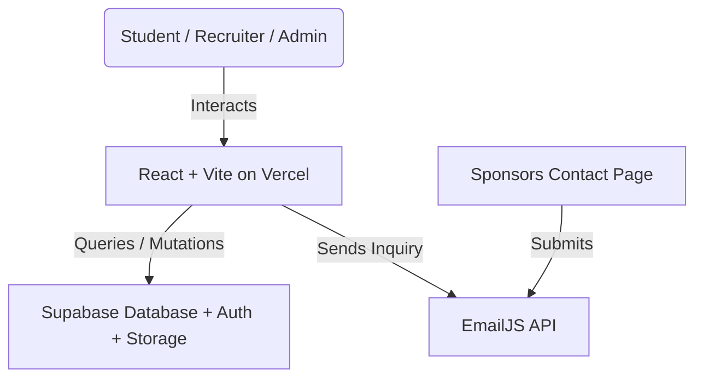

# SHPE OSU Website — Engineering Handoff

_Last updated: 2026-08-16_

Developer documentation for the Digital Operations Chair and anyone maintaining
the SHPE chapter website at The Ohio State University. Covers architecture,
database design, the security model, maintenance protocols, and deployment.

---

## 0. Where the site stands today

**Live at https://www.shpeosu.com, deployed from `main` via Vercel.**

The site is in good working order. A security review in July–August 2026 found
and closed a set of real problems; the notes below are deliberately blunt about
what was wrong, because the same mistakes are easy to repeat.

### What was fixed, and why it matters

| Area | What was wrong | State |
|---|---|---|
| **Resume book** | Approved resumes (names + OSU emails), recruiter access codes, and the resume PDFs themselves were readable by **anyone**, with no login and no code. Verified by downloading a real 130 KB resume anonymously. | ✅ Closed. Sponsors now sign in; access is enforced by Postgres. |
| **Sponsor contact form** | Every inquiry had been silently failing. The Content-Security-Policy omitted `api.emailjs.com`, so the browser blocked the request — invisible locally, because those headers only apply on Vercel. | ✅ Fixed and verified in production. |
| **Resume replacement** | Never worked. The client issued an `UPDATE` no policy permitted, which under RLS affects zero rows and *returns success* — students saw "Upload Successful" while nothing changed. | ✅ Moved into the database. |
| **Leaderboard** | The public `leaderboard` view exposed every member's OSU dot number, and the Events page printed them on a public page. Views bypass RLS, so this read straight through the protection on `attendance`. | ✅ View reduced to first name + count. |
| **Check-in** | Events added through the Admin Dashboard appeared on the calendar but could not be checked into — the check-in form read a different source. | ✅ One shared source. |
| **Upload size** | A 2 MB *minimum* rejected essentially every real resume (a normal one is 50–250 KB). | ✅ Now 10 KB–250 KB. |
| **Calendar exports** | `.ics` files were hardcoded to 06:00 UTC (2 AM Eastern) and the Google Calendar links produced unparseable dates. | ✅ Real times with an explicit timezone. |
| **`npm run lint`** | 93 errors, so nobody ran it and it caught nothing. | ✅ Clean, and a real gate. |

### Also fixed since

| Area | What was wrong | State |
|---|---|---|
| **Navigation scroll** | Clicking a tab loaded the new page at the old scroll offset and then animated to the top. Three causes: a global `scroll-behavior: smooth` that applied to the scroll-to-top as well as to anchors; `useEffect` running after paint; and the Sponsors page separately restoring its own scroll offset. | ✅ Instant, every route |
| **Footer links** | The footer kept a hand-written copy of the nav list and had drifted — Home and Prof. Dev. were missing, so two pages were unreachable from the bottom of every page. | ✅ One shared list |
| **Sponsor logos** | IBM removed at the president's request (it was a personal donation, not corporate). List updated to the five current sponsors and grouped by the tiers the chapter actually sells — the wall previously said Platinum/Gold/Bronze, which are not levels SHPE OSU offers. | ✅ Current |
| **Sponsor tier buttons** | All four "Get Started" buttons scrolled to a form that always defaulted to Buckeye ($500), so a Platinum enquiry arrived labelled as the cheapest tier. | ✅ Preselects |
| **Sponsors hero** | A ~16:9 photo in a 4:3 frame; `object-cover` discarded 27% of the width and cut people out of the group shot. | ✅ Matched |

### What is still open

*   **Autumn events.** `src/data/events.js` and the Supabase `events` table both
    contain only past events. Someone must add real dates before the first GBM or
    the check-in dropdown has nothing current to select. Do it from the Admin
    Dashboard (§4) — no code needed.
*   **Sponsor accounts.** No recruiter accounts exist yet, so nobody can use the
    corporate portal. Two steps, and people forget the second one (§4).
*   **Involvement-fair landing page.** Designed, not built. See `CLAUDE.md`.
*   **Resume ownership.** Submissions are keyed on email with no proof of
    ownership. Bounded, not solved — see §3.
*   **`PublicLeaderboard.jsx`** is committed but imported nowhere. Delete or mount.
*   **Bundle size.** One ~950 KB chunk. Code-splitting `/admin` would help, and
    matters most for the QR-code page.

## 1. System Architecture

The SHPE OSU website is built as a serverless Single Page Application (SPA) to eliminate maintenance overhead and hosting costs for the student chapter.



### Architectural Principles
*   **Zero-Cost Hosting**: Vercel handles static frontend hosting on their free tier, while Supabase handles Database, Auth, and Storage on their free tier.
*   **Serverless Data Direct Access**: The client communicates directly with Supabase via `@supabase/supabase-js`. Database records and storage assets are secured entirely via **Row-Level Security (RLS)** rules.
*   **Non-Coders Can Update Content**: Events are added through the Admin Dashboard into the Supabase `events` table — no code, no deploy. `src/data/events.js` remains as a bundled fallback so the calendar and check-in still work if Supabase is unreachable. Both readers go through `src/lib/events.js`; keep it that way.
*   **Roles, Not Just Logins**: Admins and sponsors are both Supabase Auth users, so "signed in" is not a permission. Every policy checks an explicit role claim.

---

## 2. Database Schema (PostgreSQL)

The application utilizes five tables/views and one storage bucket in Supabase. (`events` and `leaderboard` were added after the original draft of this document — see §2.4 and §2.5.)

### 1. `attendance`
Stores all student check-in records.
```sql
CREATE TABLE attendance (
  id uuid DEFAULT gen_random_uuid() PRIMARY KEY,
  created_at timestamptz DEFAULT now(),
  event_name text NOT NULL,
  first_name text NOT NULL,
  last_name_dotnum text NOT NULL,
  year text NOT NULL,
  is_first_meeting boolean NOT NULL,
  feedback text,
  major text, -- Stores standard major name or "Other – [custom text]"
  pronouns text,
  how_heard text
);
```

### 2. `resumes`
Stores student metadata and pointers to files in the Storage bucket.
```sql
CREATE TABLE resumes (
  id uuid DEFAULT gen_random_uuid() PRIMARY KEY,
  uploaded_at timestamptz DEFAULT now(),
  full_name text NOT NULL,
  email text NOT NULL,
  major text NOT NULL,
  graduation_year text NOT NULL,
  resume_path text NOT NULL, -- Format: submissions/timestamp_uuid.pdf
  approved boolean DEFAULT false NOT NULL
);
```

### 3. `company_access` — **vestigial**
Formerly stored access codes distributed to recruiters. That system was removed:
the table was publicly readable, so anyone could list every code, and the resume
book behind it was readable without a code anyway. Sponsors now use Supabase Auth
accounts. The table is kept only so historical rows are not lost — nothing reads
it for access. Drop it once you are confident no one is looking for an old code.
```sql
CREATE TABLE company_access (
  id uuid DEFAULT gen_random_uuid() PRIMARY KEY,
  created_at timestamptz DEFAULT now(),
  company_name text NOT NULL,
  access_code text NOT NULL UNIQUE, -- 8-character uppercase string
  expires_at timestamptz -- Nullable, used to restrict access after events
);
```

### Supabase Storage Bucket: `resumes`
*   Contains a folder called `submissions/` where all resume files are stored.
*   Uploads accept PDFs from **10 KB to 250 KB**. (A previous 2 MB *minimum* rejected essentially every legitimate resume, and the 5 MB ceiling let image-heavy exports eat the free-tier bucket.)
*   The 250 KB ceiling was chosen against the resumes actually on file (n=9: median 168 KB, max 305 KB). Expect it to reject roughly 1 in 5 submissions — mostly Canva/InDesign exports with an embedded photo. The upload form tells students their file's size and how to shrink it, and offers an E-Board fallback. If rejections become a support burden, raise `MAX_FILE_SIZE_BYTES` in `src/pages/ResumeUpload.jsx`; 300 KB would have accepted 8 of the 9.
*   All file permissions are private. Downloads/reads require generating a **Signed URL** with a 60-second TTL.

---

## 3. Security Architectures & Safeguards

The website contains several critical client-side and database-level security mechanisms.

### Row-Level Security (RLS) — resolved 2026-08-03

`supabase/README.md` is the authoritative description. Summary here.

**The rule that matters:** the client cannot enforce access. The anon key ships
inside the public JS bundle, so anyone can call PostgREST directly and skip the
interface. A check in a React component decides what is *rendered*, never what is
*reachable*.

That is not an abstract warning. The old policy on `resumes` was documented as
*"allowed if the recruiter has a valid session (validated client-side)"* — but
RLS runs per-row inside Postgres and cannot see browser JavaScript, so the policy
was effectively `USING (true)`. Public. The `sessionStorage` token in
`CompanyDashboard.jsx` protected nothing.

**What is enforced now**

| Table / bucket | anon | sponsor | admin |
|---|---|---|---|
| `attendance` | INSERT only (check-in) | — | full |
| `resumes` | via `submit_resume()` only | approved rows | full |
| `company_access` | — | — | full |
| `events` | SELECT | SELECT | full |
| storage `resumes` | INSERT to `submissions/` | approved files only | full |
| `leaderboard` view | SELECT (first name + count) | SELECT | SELECT |

Access is gated on an **explicit role claim**, not on merely being signed in.
This matters because public signup is enabled: without a role check, anyone could
register an account and thereby become `authenticated`. A self-registered account
holds no role and reaches nothing.

**Roles live in `app_metadata`, never `user_metadata`.** A signed-in user can
rewrite their own `user_metadata` via `supabase.auth.updateUser()`, so a role
stored there would be self-grantable — any sponsor could promote themselves to
admin from the browser console.

The role is baked into the JWT at sign-in, so **anyone whose role changes must
sign out and back in.** An admin who suddenly lands on the login page has almost
certainly hit this.

**Views bypass RLS.** `public.leaderboard` runs with its owner's privileges on
purpose — that is what lets an anonymous visitor see the leaderboard without
opening `attendance`, which holds dot numbers, pronouns, majors, and free-text
feedback students wrote expecting privacy. The consequence: **any column added to
that view is published with no policy change and nothing to review.** Treat edits
to it as security changes.

**Checking live state.** Documentation in this repo has been wrong before, so
verify rather than trust:

```sql
SELECT schemaname, tablename, policyname, roles, cmd, qual, with_check
FROM pg_policies WHERE schemaname IN ('public','storage')
ORDER BY tablename, cmd;
```

Any `{public}`/`{anon}` row with `cmd` of `UPDATE`, `DELETE`, or `ALL` is a hole.
Note this query is the *only* honest way to check writes — PostgREST returns
success for a statement matching zero rows whether or not a policy permits it, so
write access cannot be probed from outside.

**⚠️ Two saved queries in the Supabase SQL Editor will silently undo all of this
if re-run:** "Attendance Submission Table" (contains the original public-read
policies) and "Leaderboard Attendance Aggregates" (the old dot-number view).
Rename them `⚠️ OLD — DO NOT RUN`.

### Frontend Code Safeguards
1.  **Magic-Byte PDF Verification**:
    To prevent MIME-type spoofing (e.g. naming an executable malware file `resume.pdf`), `ResumeUpload.jsx` checks the first 4 bytes of the binary buffer for `%PDF` (`0x25, 0x50, 0x44, 0x46`):
    ```javascript
    async function isValidPDF(file) {
      const buf = await file.slice(0, 4).arrayBuffer();
      const bytes = new Uint8Array(buf);
      return PDF_MAGIC.every((b, i) => bytes[i] === b);
    }
    ```
2.  **Sponsor Access — Supabase Auth**:
    Recruiters sign in with an email and password and are granted a `sponsor`
    role. This replaced an 8-character code checked in the browser against a
    publicly-readable table, with the session held in `sessionStorage` — which a
    recruiter could simply write by hand. All of that machinery is deleted;
    `src/lib/companySession.js` no longer exists. Enforcement is in the database.

3.  **Server-Side Resume Submission**:
    `submit_resume()` is the only way a resume reaches the database. It runs as
    `SECURITY DEFINER`, validates every field itself, enforces the OSU email
    domain (the browser check is bypassable; this one is not), pins `approved` to
    `false` so nothing can publish itself past review, constrains the storage path
    to `submissions/`, and upserts on email so a re-upload replaces rather than
    duplicates.

4.  **CSV Injection Prevention**:
    When exporting check-in tables, cells starting with formula triggers (`=`, `+`, `-`, `@`, tab, or carriage returns) are automatically prefixed with a single-quote `'` to mitigate spreadsheet software hijack attacks.
5.  **Safe Upload Filenames**:
    User-uploaded filenames are discarded. They are renamed on upload to `submissions/${Date.now()}_${crypto.randomUUID()}.pdf` to mitigate directory traversal and path traversal exploits.

---

## 4. Maintenance & Rollover Guide

### Weekly Content Updates (E-Board Workflow)
1.  Open `src/data/events.js`.
2.  Add a new event object at the top of the `events` array. Ensure the category matches one of the values: `"GBM" | "Social" | "Professional" | "Academic" | "Outreach" | "Fundraiser"`.
3.  If showing a photo, convert your image to `.webp` format and drop it into `public/photos/events/`.
4.  Reference the path: `photo: '/photos/events/imageName.webp'`.
5.  To highlight the event in the sidebar of the home page, set `featured: true`.
6.  Push changes to GitHub:
    ```bash
    git add .
    git commit -m "feat: add upcoming GBM"
    git push origin main
    ```
    Vercel will auto-deploy in under 60 seconds.

### Onboarding a Corporate Sponsor

1.  Supabase Dashboard → **Authentication → Users → Add user**
    *   Email: the recruiter's work address
    *   Password: generate one and send it to them
    *   **Auto-confirm: ON** — without it they never receive a usable login
2.  Grant the sponsor role in the SQL Editor:
    ```sql
    UPDATE auth.users
    SET raw_app_meta_data =
          coalesce(raw_app_meta_data,'{}'::jsonb) || '{"role":"sponsor"}'::jsonb
    WHERE email = 'recruiter@company.com';
    ```
    **This step is the one people forget.** Without it they sign in successfully
    and see an empty resume book. The dashboard now says so explicitly rather
    than showing "no resumes match your criteria", but it still wastes everyone's
    time.
3.  Send them the credentials. They sign in at `/company`.

Revoking access is deleting the user, or clearing the role. The same steps are
shown in the Admin Dashboard's Companies tab.

### Adding an E-Board Admin

Same as above, but with `"role":"admin"`. Admins see the pending resume queue and
attendance data; sponsors see neither. Anyone whose role changes must sign out
and back in.

### Semester Rollover Protocols
At the start of a new semester (Autumn/Spring):
1.  **Add the new semester's events** — do this **before the first GBM**, or the
    check-in form has nothing current to select and nobody can check in.
    *   Preferred: Admin Dashboard → **Events** tab. Goes into Supabase, appears
        on the calendar and in the check-in dropdown immediately, no deploy.
    *   `src/data/events.js` is only the offline fallback. Old entries there are
        harmless — the check-in dropdown shows upcoming events first and falls
        back to recent ones, so stale entries do not crowd out real ones.
2.  **E-Board Roster Update**:
    *   Collect new E-board member headshots, convert them to `.webp`, and place them in `public/photos/eboard/`.
    *   Open `src/pages/Eboard.jsx`. Update the `eboardMembers` array with names, majors, graduation years, and roles.
    *   To adjust vertical/horizontal alignment of any headshot, modify the conditional class mapping in `LoteriaCard` (e.g. `member.id === X ? 'object-top' : 'object-center'`).
3.  **Database Attendance Rollover**:
    *   Go to the Supabase Dashboard → SQL Editor.
    *   It is recommended to run a query to back up the current semester's check-ins before truncation, or export the full history to CSV from the Admin Dashboard.
4.  **Review accounts**: graduating E-Board members should have their Supabase
    Auth accounts deleted, and expired sponsors likewise. Check with:
    ```sql
    SELECT email, raw_app_meta_data ->> 'role' AS role FROM auth.users;
    ```
5.  **Rotate Environment variables / Anon Keys**:
    *   If E-Board credentials leak, go to Supabase Dashboard → Project Settings → API.
    *   Click **Roll Project API Keys** for the `anon` key.
    *   Instantly update `VITE_SUPABASE_ANON_KEY` in the `.env` file and on Vercel Dashboard → Settings → Environment Variables.

---

## 5. Development & Contribution Guide

### Environment Variables
Setup a local `.env` file in the `shpe-osu` directory:
```env
VITE_SUPABASE_URL=https://your-project-id.supabase.co
VITE_SUPABASE_ANON_KEY=your-anon-key-here
```

### Useful CLI Commands
Run these commands inside the `/Users/leonardomedina/Documents/SHPE_web/shpe-osu` directory:

```bash
# Run local Vite development server
npm run dev

# Run local preview of build output
npm run preview

# Verify build succeeds before pushing to main
npm run build

# Run ESLint validation checks
npm run lint
```

### Git Branch Strategy
*   Never commit directly to `main` for large feature blocks.
*   Create a branch: `git checkout -b feature/your-feature-name`.
*   Verify the build locally (`npm run build`) before pushing your branch.
*   Merge branch into `main` via a GitHub Pull Request to trigger the Vercel production deployment pipeline.

---

## 6. Addendum — tables added after the original draft

### 2.4 `events`
Dynamic calendar events created from the Admin Dashboard's **Events** tab.

```sql
CREATE TABLE events (
  id uuid DEFAULT gen_random_uuid() PRIMARY KEY,
  created_at timestamptz DEFAULT now(),
  title text NOT NULL, date text NOT NULL, time text NOT NULL,
  end_time text, location text NOT NULL, description text NOT NULL,
  category text NOT NULL, featured boolean DEFAULT false NOT NULL,
  rsvp_url text DEFAULT '', photo text DEFAULT ''
);
```

Both the public calendar and the attendance check-in dropdown read this table
through `src/lib/events.js`, which merges it with the bundled fallback in
`src/data/events.js`. An event added in the Admin Dashboard is therefore
immediately checkinable.

This was previously a real trap: `Attendance.jsx` read only the static file, so a
dashboard-added event showed on the calendar but could not be checked into, with
no error explaining why. Keep both readers going through `lib/events.js` — that
split is exactly the kind that produces a silent failure at a live meeting.

### 2.5 `leaderboard` (view)
Read by `Events.jsx` and `PublicLeaderboard.jsx`. `supabase/leaderboard-view.sql`
(applied 2026-07-30) redefines it to expose exactly two columns — `first_name`
and a **distinct-event** `count`. It previously also returned `last_name_dotnum`
and `dotnum`, which were rendered onto a public page. Do not add columns: the
view runs with owner privileges and bypasses RLS on `attendance`, so anything
added here is published with no policy change to review.

---

## 7. Local verification before pushing

```bash
npm run lint     # must be clean — it is now a real gate (was 93 errors)
npm run build
npm run preview  # serves dist/ WITH the production headers from vercel.json
```

`vite.config.js` reads `vercel.json` and applies the same security headers to
the preview server. This exists because a missing `connect-src` entry silently
broke the sponsor contact form in production and was invisible locally — CSP
headers only applied on Vercel. Open the browser console on `npm run preview`
and confirm there are no CSP violations before deploying.

**Lint and build do not catch everything.** Both passed while the sponsor form
was completely broken in production, while calendar exports emitted 2 AM events,
and while a "View PDF" button opened a blank tab and hijacked the current one.
Click the thing you changed.

### Project subagents

`.claude/agents/` holds three read-only reviewers preloaded with this codebase's
actual failure modes:

| Agent | Use it |
|---|---|
| `security-auditor` | After touching Supabase, before a release |
| `code-reviewer` | Before committing |
| `deploy-preflight` | Before pushing to `main`, and at semester rollover |

Invoke them by name in Claude Code, e.g. *"Use the security-auditor agent to
check the current RLS posture."* They found the role-gating hole described in §3,
a check-in bug that would have stranded an entire GBM, and a timezone error that
only misfired during meeting hours — all in work that had already been reviewed
by hand and passed both gates.
