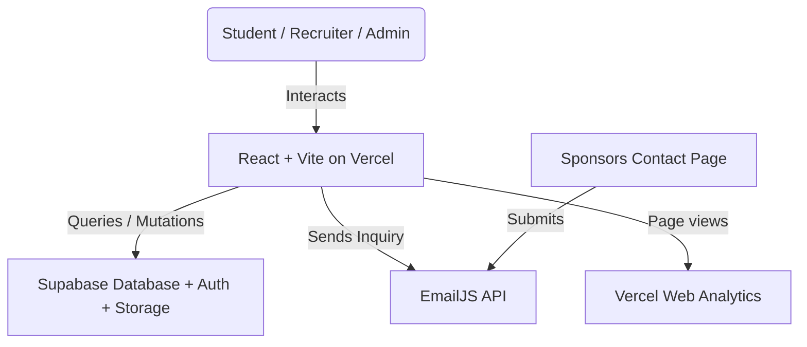

# SHPE OSU Website — Engineering Handoff

_Last updated: 2026-08-30_

Developer documentation for the Digital Operations Chair and anyone maintaining
the SHPE chapter website at The Ohio State University. Covers architecture,
database design, the security model, maintenance protocols, and deployment.

---

## 0. Where the site stands today

**Live at https://www.shpeosu.com, deployed from `main` via Vercel.**

The site is in good working order. A security review in July–August 2026 found
and closed a set of real problems; the notes below are deliberately blunt about
what was wrong, because the same mistakes are easy to repeat.

### What was fixed, and why it matters

| Area | What was wrong | State |
|---|---|---|
| **Resume book** | Approved resumes (names + OSU emails), recruiter access codes, and the resume PDFs themselves were readable by **anyone**, with no login and no code. Verified by downloading a real 130 KB resume anonymously. | ✅ Closed. Sponsors now sign in; access is enforced by Postgres. |
| **Sponsor contact form** | Every inquiry had been silently failing. The Content-Security-Policy omitted `api.emailjs.com`, so the browser blocked the request — invisible locally, because those headers only apply on Vercel. | ✅ Fixed and verified in production. |
| **Resume replacement** | Never worked. The client issued an `UPDATE` no policy permitted, which under RLS affects zero rows and *returns success* — students saw "Upload Successful" while nothing changed. | ✅ Moved into the database. |
| **Leaderboard** | The public `leaderboard` view exposed every member's OSU dot number, and the Events page printed them on a public page. Views bypass RLS, so this read straight through the protection on `attendance`. | ✅ View reduced to first name + count. |
| **Check-in** | Events added through the Admin Dashboard appeared on the calendar but could not be checked into — the check-in form read a different source. | ✅ One shared source. |
| **Upload size** | A 2 MB *minimum* rejected essentially every real resume (a normal one is 50–250 KB). | ✅ Now 10 KB–250 KB. |
| **Calendar exports** | `.ics` files were hardcoded to 06:00 UTC (2 AM Eastern) and the Google Calendar links produced unparseable dates. | ✅ Real times with an explicit timezone. |
| **`npm run lint`** | 93 errors, so nobody ran it and it caught nothing. | ✅ Clean, and a real gate. |

### Also fixed since

| Area | What was wrong | State |
|---|---|---|
| **Navigation scroll** | Clicking a tab loaded the new page at the old scroll offset and then animated to the top. Three causes: a global `scroll-behavior: smooth` that applied to the scroll-to-top as well as to anchors; `useEffect` running after paint; and the Sponsors page separately restoring its own scroll offset. | ✅ Instant, every route |
| **Footer links** | The footer kept a hand-written copy of the nav list and had drifted — Home and Prof. Dev. were missing, so two pages were unreachable from the bottom of every page. | ✅ One shared list |
| **Sponsor logos** | IBM removed at the president's request (it was a personal donation, not corporate). List updated to the five current sponsors and grouped by the tiers the chapter actually sells — the wall previously said Platinum/Gold/Bronze, which are not levels SHPE OSU offers. | ✅ Current |
| **Sponsor tier buttons** | All four "Get Started" buttons scrolled to a form that always defaulted to Buckeye ($500), so a Platinum enquiry arrived labelled as the cheapest tier. | ✅ Preselects |
| **Sponsors hero** | A ~16:9 photo in a 4:3 frame; `object-cover` discarded 27% of the width and cut people out of the group shot. | ✅ Matched |

### What is still open

*   **Upcoming events.** The first two Autumn 2026 events have passed. The E-Board
    will add the next dates through the Admin Dashboard (§4). The bundled event
    list is only the outage fallback and should not be treated as the editor.
*   **Sponsor accounts.** No recruiter accounts exist yet, so nobody can use the
    corporate portal. Two steps, and people forget the second one (§4).
*   **Resume ownership.** Submissions are keyed on email with no proof of
    ownership. Bounded, not solved — see §3.
*   **`PublicLeaderboard.jsx`** is committed but imported nowhere. Delete or mount.
*   **Automated tests.** There is no test script yet. `REWRITE.md` Phase 0 lists
    the regression suite that should land before a data-layer rewrite.
*   **Admin maintainability.** `AdminDashboard.jsx` is still one large five-tab
    file. The heavy admin, company, and professional-development routes are now
    code-split, but the dashboard itself should eventually be divided by tab.

## 1. System Architecture

The SHPE OSU website is built as a serverless Single Page Application (SPA) to eliminate maintenance overhead and hosting costs for the student chapter.



### Architectural Principles
*   **Zero-Cost Hosting**: Vercel handles static frontend hosting on their free tier, while Supabase handles Database, Auth, and Storage on their free tier.
*   **Serverless Data Direct Access**: The client communicates directly with Supabase via `@supabase/supabase-js`. Database records and storage assets are secured entirely via **Row-Level Security (RLS)** rules.
*   **Non-Coders Can Update Content**: Events are added through the Admin Dashboard into the Supabase `events` table — no code, no deploy. `src/data/events.js` remains as a bundled fallback so the calendar and check-in still work if Supabase is unreachable. Both readers go through `src/lib/events.js`; keep it that way.
*   **Roles, Not Just Logins**: Admins and sponsors are both Supabase Auth users, so "signed in" is not a permission. Every policy checks an explicit role claim.
*   **Analytics**: `src/main.jsx` mounts `@vercel/analytics/react` once at the
    application root. Web Analytics must also be enabled in the Vercel project.
    Collection starts after deployment; local development traffic is not counted.
*   **Attendance trend dates**: The dashboard derives each trend point from the
    `M/D - title` prefix stored in `attendance.event_name`, using `created_at`
    only to infer the correct year. A late check-in therefore stays on its
    event's chart date while `created_at` remains the true audit timestamp.

---

## 2. Database Schema (PostgreSQL)

The application utilizes five tables/views and one storage bucket in Supabase. (`events` and `leaderboard` were added after the original draft of this document — see §2.4 and §2.5.)

### 1. `attendance`
Stores all student check-in records.
```sql
CREATE TABLE attendance (
  id uuid DEFAULT gen_random_uuid() PRIMARY KEY,
  created_at timestamptz DEFAULT now(),
  event_name text NOT NULL,
  first_name text NOT NULL,
  last_name_dotnum text NOT NULL,
  year text NOT NULL,
  is_first_meeting boolean NOT NULL,
  feedback text,
  major text, -- Stores standard major name or "Other – [custom text]"
  pronouns text,
  how_heard text
);
```

### 2. `resumes`
Stores student metadata and pointers to files in the Storage bucket.
```sql
CREATE TABLE resumes (
  id uuid DEFAULT gen_random_uuid() PRIMARY KEY,
  uploaded_at timestamptz DEFAULT now(),
  full_name text NOT NULL,
  email text NOT NULL,
  major text NOT NULL,
  graduation_year text NOT NULL,
  resume_path text NOT NULL, -- Format: submissions/timestamp_uuid.pdf
  approved boolean DEFAULT false NOT NULL
);
```

### 3. `company_access` — **vestigial**
Formerly stored access codes distributed to recruiters. That system was removed:
the table was publicly readable, so anyone could list every code, and the resume
book behind it was readable without a code anyway. Sponsors now use Supabase Auth
accounts. The table is kept only so historical rows are not lost — nothing reads
it for access. Drop it once you are confident no one is looking for an old code.
```sql
CREATE TABLE company_access (
  id uuid DEFAULT gen_random_uuid() PRIMARY KEY,
  created_at timestamptz DEFAULT now(),
  company_name text NOT NULL,
  access_code text NOT NULL UNIQUE, -- 8-character uppercase string
  expires_at timestamptz -- Nullable, used to restrict access after events
);
```

### Supabase Storage Bucket: `resumes`
*   Contains a folder called `submissions/` where all resume files are stored.
*   Uploads accept PDFs from **10 KB to 250 KB**. (A previous 2 MB *minimum* rejected essentially every legitimate resume, and the 5 MB ceiling let image-heavy exports eat the free-tier bucket.)
*   The 250 KB ceiling was chosen against the resumes actually on file (n=9: median 168 KB, max 305 KB). Expect it to reject roughly 1 in 5 submissions — mostly Canva/InDesign exports with an embedded photo. The upload form tells students their file's size and how to shrink it, and offers an E-Board fallback. If rejections become a support burden, raise `MAX_FILE_SIZE_BYTES` in `src/pages/ResumeUpload.jsx`; 300 KB would have accepted 8 of the 9.
*   All file permissions are private. Downloads/reads require generating a **Signed URL** with a 60-second TTL.

---

## 3. Security Architectures & Safeguards

The website contains several critical client-side and database-level security mechanisms.

### Row-Level Security (RLS) — resolved 2026-08-03

`supabase/README.md` is the authoritative description. Summary here.

**The rule that matters:** the client cannot enforce access. The anon key ships
inside the public JS bundle, so anyone can call PostgREST directly and skip the
interface. A check in a React component decides what is *rendered*, never what is
*reachable*.

That is not an abstract warning. The old policy on `resumes` was documented as
*"allowed if the recruiter has a valid session (validated client-side)"* — but
RLS runs per-row inside Postgres and cannot see browser JavaScript, so the policy
was effectively `USING (true)`. Public. The `sessionStorage` token in
`CompanyDashboard.jsx` protected nothing.

**What is enforced now**

| Table / bucket | anon | sponsor | admin |
|---|---|---|---|
| `attendance` | INSERT only (check-in) | — | full |
| `resumes` | via `submit_resume()` only | approved rows | full |
| `company_access` | — | — | full |
| `events` | SELECT | SELECT | full |
| storage `resumes` | INSERT to `submissions/` | approved files only | full |
| `leaderboard` view | SELECT (first name + count) | SELECT | SELECT |

Access is gated on an **explicit role claim**, not on merely being signed in.
Public signup is currently disabled, but that is defence in depth rather than
the permission boundary. If someone re-enables it, a self-registered account is
merely `authenticated`; without an explicit role it must still reach nothing.

**Roles live in `app_metadata`, never `user_metadata`.** A signed-in user can
rewrite their own `user_metadata` via `supabase.auth.updateUser()`, so a role
stored there would be self-grantable — any sponsor could promote themselves to
admin from the browser console.

The role is baked into the JWT at sign-in, so **anyone whose role changes must
sign out and back in.** An admin who suddenly lands on the login page has almost
certainly hit this.

**Views bypass RLS.** `public.leaderboard` runs with its owner's privileges on
purpose — that is what lets an anonymous visitor see the leaderboard without
opening `attendance`, which holds dot numbers, pronouns, majors, and free-text
feedback students wrote expecting privacy. The consequence: **any column added to
that view is published with no policy change and nothing to review.** Treat edits
to it as security changes.

**Checking live state.** Documentation in this repo has been wrong before, so
verify rather than trust:

```sql
SELECT schemaname, tablename, policyname, roles, cmd, qual, with_check
FROM pg_policies WHERE schemaname IN ('public','storage')
ORDER BY tablename, cmd;
```

Any `{public}`/`{anon}` row with `cmd` of `UPDATE`, `DELETE`, or `ALL` is a hole.
Note this query is the *only* honest way to check writes — PostgREST returns
success for a statement matching zero rows whether or not a policy permits it, so
write access cannot be probed from outside.

**⚠️ Two saved queries in the Supabase SQL Editor will silently undo all of this
if re-run:** "Attendance Submission Table" (contains the original public-read
policies) and "Leaderboard Attendance Aggregates" (the old dot-number view).
Rename them `⚠️ OLD — DO NOT RUN`.

### Frontend Code Safeguards
1.  **Magic-Byte PDF Verification**:
    To prevent MIME-type spoofing (e.g. naming an executable malware file `resume.pdf`), `ResumeUpload.jsx` checks the first 4 bytes of the binary buffer for `%PDF` (`0x25, 0x50, 0x44, 0x46`):
    ```javascript
    async function isValidPDF(file) {
      const buf = await file.slice(0, 4).arrayBuffer();
      const bytes = new Uint8Array(buf);
      return PDF_MAGIC.every((b, i) => bytes[i] === b);
    }
    ```
2.  **Sponsor Access — Supabase Auth**:
    Recruiters sign in with an email and password and are granted a `sponsor`
    role. This replaced an 8-character code checked in the browser against a
    publicly-readable table, with the session held in `sessionStorage` — which a
    recruiter could simply write by hand. All of that machinery is deleted;
    `src/lib/companySession.js` no longer exists. Enforcement is in the database.

3.  **Server-Side Resume Submission**:
    `submit_resume()` is the only way a resume reaches the database. It runs as
    `SECURITY DEFINER`, validates every field itself, enforces the OSU email
    domain (the browser check is bypassable; this one is not), pins `approved` to
    `false` so nothing can publish itself past review, constrains the storage path
    to `submissions/`, and upserts on email so a re-upload replaces rather than
    duplicates.

4.  **CSV Injection Prevention**:
    When exporting check-in tables, cells starting with formula triggers (`=`, `+`, `-`, `@`, tab, or carriage returns) are automatically prefixed with a single-quote `'` to mitigate spreadsheet software hijack attacks.
5.  **Safe Upload Filenames**:
    User-uploaded filenames are discarded. They are renamed on upload to `submissions/${Date.now()}_${crypto.randomUUID()}.pdf` to mitigate directory traversal and path traversal exploits.

---

## 4. Maintenance & Rollover Guide

### Weekly Content Updates (E-Board Workflow)
1.  Open the Admin Dashboard and select the **Events** tab.
2.  Add or edit the event there. Use one of the supported categories:
    `"GBM" | "Social" | "Professional" | "Academic" | "Outreach" | "Fundraiser"`.
    The image is optional. Events without one receive a branded category panel;
    uploaded flyers are displayed uncropped and link to the original full-size
    file from the event details modal.
3.  Confirm it appears on `/events` and in the `/attendance` dropdown. Both read
    through `src/lib/events.js`, so there should be no second code change.
4.  Before an event where check-in must survive a Supabase outage, mirror the
    exact title and date into `src/data/events.js` on a branch. This is an
    intentional emergency fallback, not the normal content workflow. A title or
    date mismatch creates a duplicate and can split attendance history.

### The attendance QR code

`qr/attendance.png` and `qr/attendance.svg` encode
**https://www.shpeosu.com/attendance**. Send the PNG for Slack, the SVG for print.

**It never expires and never needs refreshing.** A QR code is just a URL drawn as
an image — there is no account, no service, and nothing phoning home. It works
for as long as that URL works. Regenerate only if the route is renamed, the
domain changes, or it should point somewhere else:

```bash
npm run qr
```

Deliberately NOT a "dynamic QR" from a generator website. Those route through the
vendor's servers and die when the free tier ends or the company folds — taking
every printed poster with them. This one has no third party in the path, so the
destination can be changed from this repo without reprinting anything.

**⚠️ The one thing that would break every printed code: domain expiry.**
`shpeosu.com` is registered through Cloudflare and expires **2027-05-18**. If it
lapses, every QR on every table tent stops working at the same moment, along with
the site. Make sure auto-renew is on and the card on file outlives whoever added
it — a graduating member's personal card is the usual way this fails.

Printing: ~1.5 in for a table tent, ~4 in for a poster. Print the URL as text
underneath as a fallback, never crop the white border, and test on both an iPhone
and an Android before sending to print.

### Backup check-in form

**The problem it solves.** If the Supabase insert on `/attendance` fails, the
check-in is gone — nothing is queued and nothing is retried. During a GBM that
means no attendance record for the whole meeting, and the student sees only a
generic error. `src/lib/attendanceFallback.js` adds a "Check in with the backup
form" button to that error state, pointing at a Google Form that collects the
same fields.

**What it does and does not cover.** It covers *Supabase broken, network fine* —
the project paused, rate-limited, or a policy changed. It does **not** help when
the venue's wifi is down, because Google is equally unreachable then. That case
needs a printed sign-in sheet, which costs nothing and should exist anyway.

**Status: live.** The form is configured in `src/lib/attendanceFallback.js`. To
turn it off, blank out `baseUrl` — `buildFallbackUrl()` then returns `null` and
the check-in page behaves exactly as it did before.

#### The form in use

[26 - 27 SHPE Attendance Form Professional Development](https://docs.google.com/forms/d/e/1FAIpQLSetATIx52meiHRLa0jWvAe67AXKAvlS1D_H3Wy7P2w0v-7wrQ/viewform)

| Form question | Prefilled from | Entry ID |
|---|---|---|
| Which event did you attend? | **not prefilled** — see below | `entry.2079501292` |
| First name | `first_name` | `entry.1755853879` |
| Last Name.## | `last_name_dotnum` | `entry.835781843` |
| Year | `year` | `entry.1231543127` |
| Is this your first meeting? | `is_first_meeting` → Yes/No | `entry.17060628` |
| Any feedback/suggestions? | **not prefilled** — see below | `entry.1494295762` |

This path exists to capture **who was in the room** — first name and
Last Name.## — when the database will not accept the check-in. `major` and
`how_heard` have no questions on this form and are dropped on this path.

`feedback` is deliberately left for the student to type. It is the one field
with unbounded sensitivity, it is not what this path exists to capture, and
prefilling it would put free text into a URL that Google logs and the student's
browser stores in plaintext history. Leaving it out also caps the link's length.

To change the mapping later: form → **⋮** → **Get pre-filled link**, enter a
dummy value in each field, **Get link**, then read the `entry.123456789=` pairs
out of the resulting URL. An empty string in `entries` means "leave this for the
student to fill in", so a partial mapping is always safe.

#### ⚠️ The event label differs from the site's

The form keeps its own hand-maintained event list, worded differently from what
the site generates:

    form:  8/27 - Resume Workshop w/Pratt Whitney
    site:  8/27 - RESUME WORKSHOP w/ RTX      ← what attendance.event_name holds

Two consequences:

1. **The event is not prefilled.** Google preselects a multiple-choice option
   only on an exact match, so prefilling would silently select nothing. The
   student picks from the form's own list instead.
2. **Translate the label when merging.** A form row will say
   "Resume Workshop w/Pratt Whitney", but `attendance` must receive
   `8/27 - RESUME WORKSHOP w/ RTX`. Insert the form's wording verbatim and that
   event's history splits into two buckets that never reconcile, with nothing to
   warn you — `REWRITE.md` §6.1.

If you print a paper sheet as the deeper fallback, write the **site's** label
across the top, for the same reason.

#### Known gaps in the current form

Worth knowing before you rely on it, and all fixable in the form editor:

- **GBMs are not on the event list** — it currently covers professional
  development events only, so a failed check-in at a GBM has no matching option.
- **The event list does not update itself** when an event is added through the
  Admin Dashboard. It drifts unless someone edits the form each semester.
- **Feedback is a required question** on the form but optional on the site, so a
  student with nothing to say must type something before they can submit.
- **Year** offers 1st–5th only; there is no *Graduate Student* or *Professional*.

Changing "Which event did you attend?" to a **Short answer** would fix the first
two permanently: `event_name` could then be prefilled exactly, no translation
would be needed at merge time, and the list would never need maintaining.

#### Merging responses back in

Responses land in a Google Sheet, not in `attendance`. There is no import button —
the Admin Dashboard exports CSV but does not read it.

**⚠️ Do not paste form answers into a hand-written `INSERT` in the SQL Editor.**
The form is unauthenticated and its URL ships in the public bundle, so anyone can
submit any text into that Sheet. The SQL Editor runs as `postgres`, privileged
and exempt from RLS, so pasting untrusted text straight into a quoted SQL string
is an injection into the most powerful console in the project. The harmless
version of the same bug fires on the first student named **O'Brien** — and the
fact that an apostrophe breaks it is exactly what proves the values are not
being escaped.

Use one of these instead:

1. **Table Editor → Insert row** (preferred). Values are parameterised, so no
   amount of punctuation in a name can change the statement.
2. **CSV import** from the Sheet, if there are many rows.
3. If you must use SQL, **dollar-quote every value** so quotes cannot terminate
   the string:

   ```sql
   INSERT INTO attendance
     (event_name, first_name, last_name_dotnum, year, is_first_meeting, major, how_heard, feedback)
   VALUES
     ($q$8/28 - General Body Meeting #1: SHPES AND SALSA$q$, $q$Maria$q$,
      $q$Buckeye.01$q$, $q$1st Year$q$, true, $q$Mechanical Engineering$q$,
      $q$Involvement Fair / Tabling$q$, NULL);
   ```

Because anyone can post to the form, **sanity-check the rows against who was
actually in the room** before merging. Treat it as a sign-in sheet someone could
have scribbled on, not as trusted data.

Three things to check before merging:

- **The event label** — the form's wording is not the site's. Translate it to the
  `eventOptionLabel()` form (`8/27 - RESUME WORKSHOP w/ RTX`), per the warning
  above, or that event's attendance splits in two.
- **`major`** — the form has no major question, so these rows arrive without one.
  If you collect it another way and it falls outside the standard list, store it
  as `Other – <their text>` with an **en dash** (U+2013), matching
  `src/lib/majors.js`. A hyphen here is invisible and breaks every filter.
- **Duplicates** — someone may have submitted the form *and* successfully checked
  in on a retry. The leaderboard counts distinct events so rankings are safe, but
  the dashboard's raw check-in total would run high. Worth a look:

  ```sql
  SELECT event_name, first_name, last_name_dotnum, count(*)
  FROM attendance GROUP BY 1,2,3 HAVING count(*) > 1;
  ```

Clear the Sheet after merging, so next semester's outage does not get mixed in
with this one's.

### Onboarding a Corporate Sponsor

1.  Supabase Dashboard → **Authentication → Users → Add user**
    *   Email: the recruiter's work address
    *   Password: generate one and send it to them
    *   **Auto-confirm: ON** — without it they never receive a usable login
2.  Grant the sponsor role in the SQL Editor:
    ```sql
    UPDATE auth.users
    SET raw_app_meta_data =
          coalesce(raw_app_meta_data,'{}'::jsonb) || '{"role":"sponsor"}'::jsonb
    WHERE email = 'recruiter@company.com';
    ```
    **This step is the one people forget.** Without it they sign in successfully
    and see an empty resume book. The dashboard now says so explicitly rather
    than showing "no resumes match your criteria", but it still wastes everyone's
    time.
3.  Send them the credentials. They sign in at `/company`.

Revoking access is deleting the user, or clearing the role. The same steps are
shown in the Admin Dashboard's Companies tab.

### Adding an E-Board Admin

Same as above, but with `"role":"admin"`. Admins see the pending resume queue and
attendance data; sponsors see neither. Anyone whose role changes must sign out
and back in.

### Semester Rollover Protocols
At the start of a new semester (Autumn/Spring):
1.  **Add the new semester's events** — do this **before the first GBM**, or the
    check-in form has nothing current to select and nobody can check in.
    *   Preferred: Admin Dashboard → **Events** tab. Goes into Supabase, appears
        on the calendar and in the check-in dropdown immediately, no deploy.
    *   `src/data/events.js` is only the offline fallback. Old entries there are
        harmless — the check-in dropdown shows upcoming events first and falls
        back to recent ones, so stale entries do not crowd out real ones.
2.  **E-Board Roster Update**:
    *   Collect new E-board member headshots, convert them to `.webp`, and place them in `public/photos/eboard/`.
    *   Open `src/pages/Eboard.jsx`. Update the `eboardMembers` array with names, majors, graduation years, and roles.
    *   To adjust vertical/horizontal alignment of any headshot, modify the conditional class mapping in `LoteriaCard` (e.g. `member.id === X ? 'object-top' : 'object-center'`).
3.  **Database Attendance Rollover**:
    *   Go to the Supabase Dashboard → SQL Editor.
    *   It is recommended to run a query to back up the current semester's check-ins before truncation, or export the full history to CSV from the Admin Dashboard.
4.  **Review accounts**: graduating E-Board members should have their Supabase
    Auth accounts deleted, and expired sponsors likewise. Check with:
    ```sql
    SELECT email, raw_app_meta_data ->> 'role' AS role FROM auth.users;
    ```
5.  **Rotate Environment variables / Anon Keys**:
    *   If E-Board credentials leak, go to Supabase Dashboard → Project Settings → API.
    *   Click **Roll Project API Keys** for the `anon` key.
    *   Instantly update `VITE_SUPABASE_ANON_KEY` in the `.env` file and on Vercel Dashboard → Settings → Environment Variables.

---

## 5. Development & Contribution Guide

### Environment Variables
Setup a local `.env` file in the `shpe-osu` directory:
```env
VITE_SUPABASE_URL=https://your-project-id.supabase.co
VITE_SUPABASE_ANON_KEY=your-anon-key-here
```

### Useful CLI Commands
Run these commands inside the `/Users/leonardomedina/Documents/SHPE_web/shpe-osu` directory:

```bash
# Run local Vite development server
npm run dev

# Run local preview of build output
npm run preview

# Verify build succeeds before pushing to main
npm run build

# Run ESLint validation checks
npm run lint
```

### Git Branch Strategy
*   **Always work on a branch unless the project owner explicitly says to work
    on `main`.** This applies to fixes, documentation, and content changes—not
    only large features.
*   Start from an up-to-date `main`, then create a focused branch:
    ```bash
    git switch main
    git pull --ff-only
    git switch -c feature/your-change
    ```
*   Review ordinary UI work with `npm run dev` at
    <http://localhost:5173>.
*   Before pushing, run `npm run lint`, `npm run build`, then `npm run preview`.
    Preview normally runs at <http://localhost:4173> and includes the production
    security headers that `npm run dev` does not.
*   Merge the branch into `main` through a GitHub Pull Request. Vercel deploys
    production from `main`; do not merge until the local review is approved.

---

## 6. Addendum — tables added after the original draft

### 2.4 `events`
Dynamic calendar events created from the Admin Dashboard's **Events** tab.

```sql
CREATE TABLE events (
  id uuid DEFAULT gen_random_uuid() PRIMARY KEY,
  created_at timestamptz DEFAULT now(),
  title text NOT NULL, date text NOT NULL, time text NOT NULL,
  end_time text, location text NOT NULL, description text NOT NULL,
  category text NOT NULL, featured boolean DEFAULT false NOT NULL,
  rsvp_url text DEFAULT '', photo text DEFAULT ''
);
```

Both the public calendar and the attendance check-in dropdown read this table
through `src/lib/events.js`, which merges it with the bundled fallback in
`src/data/events.js`. An event added in the Admin Dashboard is therefore
immediately checkinable.

This was previously a real trap: `Attendance.jsx` read only the static file, so a
dashboard-added event showed on the calendar but could not be checked into, with
no error explaining why. Keep both readers going through `lib/events.js` — that
split is exactly the kind that produces a silent failure at a live meeting.

### 2.5 `leaderboard` (view)
Read by `Events.jsx` and `PublicLeaderboard.jsx`. `supabase/leaderboard-view.sql`
(applied 2026-07-30) redefines it to expose exactly two columns — `first_name`
and a **distinct-event** `count`. It previously also returned `last_name_dotnum`
and `dotnum`, which were rendered onto a public page. Do not add columns: the
view runs with owner privileges and bypasses RLS on `attendance`, so anything
added here is published with no policy change to review.

---

## 7. Local verification before pushing

Do this from a feature/fix/docs branch unless the project owner explicitly
authorized work directly on `main`.

```bash
npm run lint     # must be clean — it is now a real gate (was 93 errors)
npm run build
npm run preview  # serves dist/ WITH the production headers from vercel.json
```

`vite.config.js` reads `vercel.json` and applies the same security headers to
the preview server. This exists because a missing `connect-src` entry silently
broke the sponsor contact form in production and was invisible locally — CSP
headers only applied on Vercel. Open the browser console on `npm run preview`
and confirm there are no CSP violations before deploying.

**Lint and build do not catch everything.** Both passed while the sponsor form
was completely broken in production, while calendar exports emitted 2 AM events,
and while a "View PDF" button opened a blank tab and hijacked the current one.
Click the thing you changed.

After deploying an Analytics change, visit more than one production route and
confirm the browser Network panel shows Vercel's same-origin analytics request.
The current CSP already permits the Vercel-managed same-origin endpoint; do not
add a broad external script or connection source without evidence it is needed.

The app now lazily loads the admin dashboard, recruiter dashboard, and
professional-development page. A local build on 2026-08-30 produced an initial
JavaScript chunk of about 484 KB and a separate admin chunk of about 456 KB. Do
not collapse these back into one eager bundle.

### Project subagents

`.claude/agents/` holds three read-only reviewers preloaded with this codebase's
actual failure modes:

| Agent | Use it |
|---|---|
| `security-auditor` | After touching Supabase, before a release |
| `code-reviewer` | Before committing |
| `deploy-preflight` | Before pushing to `main`, and at semester rollover |

Invoke them by name in Claude Code, e.g. *"Use the security-auditor agent to
check the current RLS posture."* They found the role-gating hole described in §3,
a check-in bug that would have stranded an entire GBM, and a timezone error that
only misfired during meeting hours — all in work that had already been reviewed
by hand and passed both gates.
